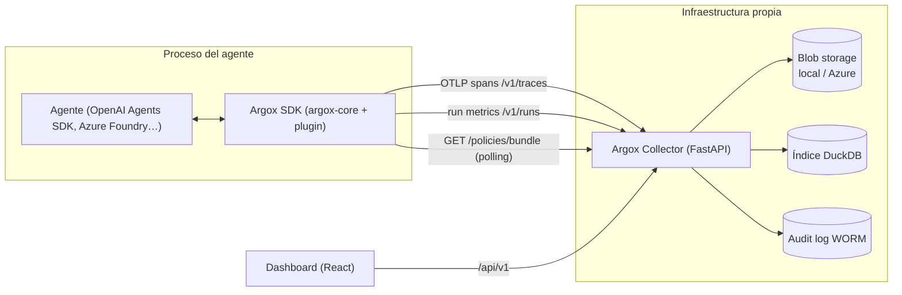

# Documentación de Argox

> **Idioma:** Esta documentación está escrita en **español** por decisión explícita
> del equipo para esta carpeta. El resto de outputs del repositorio (código, commits,
> PRs y los *living-docs* de `argox-project/docs/`) siguen en inglés según `CLAUDE.md`.

**Argox** es una plataforma open-source de **observabilidad, gobernanza y auditoría
para agentes de IA**. Da a los equipos visibilidad de qué hace un agente, por qué lo
hace y si debería poder hacerlo: captura cada decisión, llamada a herramienta y salida
en tiempo real, las evalúa contra políticas configurables y lo persiste todo en un
rastro auditable pensado para cumplimiento regulatorio (EU AI Act, Reg. 2024/1689).

El sistema tiene tres componentes:

- **SDK** (`argox-core` + plugins/exporters): vive **dentro del proceso del agente**.
  Instrumenta la ejecución, aplica políticas en el *hot-path* (sin red), redacta PII y
  exporta spans (OTLP) y métricas de run (HTTP) al Collector.
- **Collector** (`argox-collector`): servicio **FastAPI** self-hosted. Ingiere spans y
  runs, los enriquece (coste, PII residual), los almacena (blob + índice DuckDB),
  mantiene un audit log WORM y distribuye las políticas activas a los SDK.
- **Dashboard** (`argox-dashboard`): SPA **React + Vite** que consume `/api/v1` del
  Collector para explorar trazas, métricas, runs, políticas y claves de API.

## Índice

### Visión general
- [Arquitectura del sistema](overview/architecture.md) — los tres componentes y cómo encajan.
- [Flujo de datos](overview/data-flow.md) — ciclo de vida de un run de principio a fin.

### SDK (en profundidad)
- [Visión general del SDK](sdk/README.md)
- [Core: `monitor`, `ArgoxManager`, ciclo de run](sdk/core.md)
- [Interfaces de extensión](sdk/interfaces.md)
- [Plugins (discovery por entry-points)](sdk/plugins.md)
- [Exporters (spans y runs)](sdk/exporters.md)
- [Processors y redacción de PII](sdk/processors.md)
- [Observabilidad OTel y semconv](sdk/observability.md)
- [Empaquetado y dependencias](sdk/packaging.md)

### Collector (en profundidad)
- [Visión general del Collector](collector/README.md)
- [Arquitectura interna](collector/architecture.md)
- [Ingesta (`/v1/traces`, `/v1/runs`)](collector/ingest.md)
- [Enriquecimiento](collector/enrichment.md)
- [Almacenamiento e índice](collector/storage-and-index.md)
- [Audit log WORM](collector/audit.md)
- [Autenticación y autorización](collector/auth.md)
- [Referencia de la API](collector/api-reference.md)
- [Configuración (variables `ARGOX_*`)](collector/configuration.md)

### Sistema de políticas (detallado)
- [Visión general](policies/README.md)
- [Referencia completa de reglas](policies/reference.md)
- [Evaluación y enforcement](policies/evaluation.md)
- [Ciclo de vida y versionado](policies/lifecycle.md)
- [Guía de uso paso a paso](policies/usage-guide.md)

### Dashboard
- [Visión general](dashboard/README.md)
- [Pantallas](dashboard/screens.md)
- [Datos y autenticación](dashboard/data-and-auth.md)

## Relación con los *living-docs*

Esta carpeta `docs/` es una **explicación estructurada y navegable** del sistema. Los
*living-docs* en `argox-project/docs/` (devlog, ADRs, `sdk/overview.md`, `insights/`)
siguen siendo la **fuente de verdad sobre decisiones y cronología**: se enlazan desde
aquí cuando aportan contexto, pero no se duplican.

| Recurso | Ubicación | Qué captura |
|---|---|---|
| Devlog | `argox-project/docs/devlog/` | Una entrada por ticket/PR: qué cambió y por qué. |
| ADRs | `argox-project/docs/architecture/` | Decisiones arquitectónicas bloqueadas. |
| Errores e insights | `argox-project/docs/insights/` | Bugs no triviales y benchmarks. |
| SDK overview | `argox-project/docs/sdk/overview.md` | Explicación conceptual del SDK, sincronizada con el código. |
