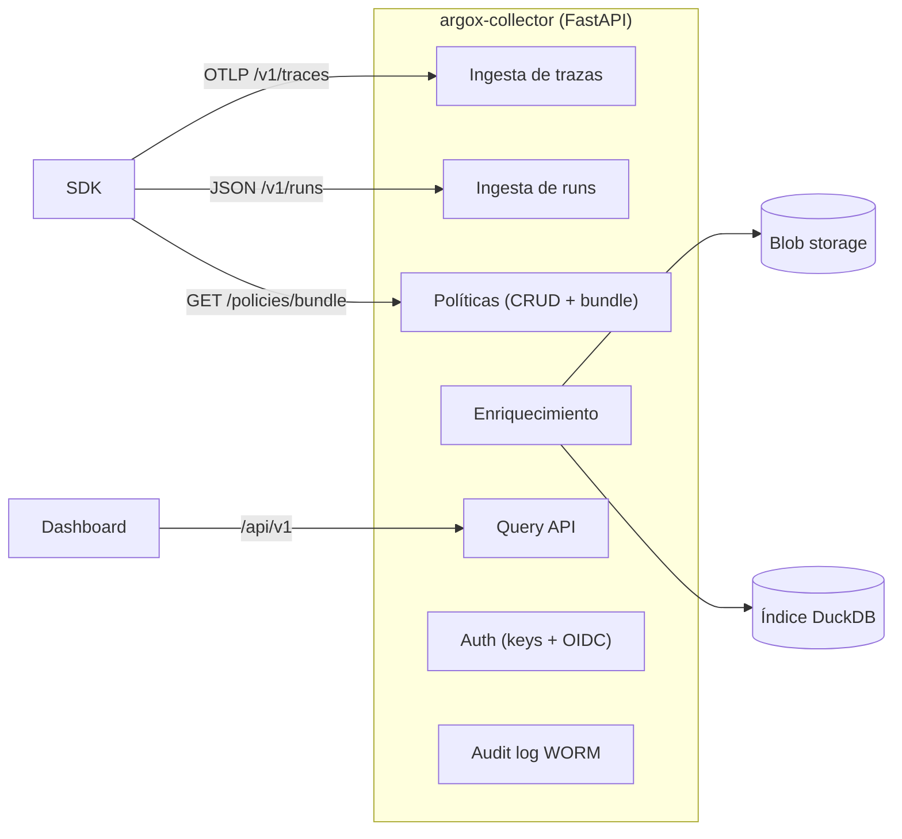

# Collector de Argox

El **Collector** (`argox-collector`) es el servicio server-side de Argox: ingiere los
spans y runs que envían los SDK, los enriquece, los almacena y los indexa, mantiene un
audit log inmutable y distribuye las políticas activas. Es **self-hosted**: corre en
infraestructura del operador, sin SaaS.

No es un exporter: **recibe, enriquece, almacena y sirve**. Los exporters viven en el SDK.

## Qué hace



## Stack y ejecución

| Aspecto | Detalle |
|---|---|
| Framework | **FastAPI** sobre **uvicorn** |
| Almacenamiento | Blob (local FS o **Azure Blob**) + índice **DuckDB** |
| Logging | `structlog` |
| Empaquetado | `argox-collector`, console-script `argox-collector` |
| Arranque | `argox-collector` (lanza uvicorn en `ARGOX_HOST:ARGOX_PORT`, default `0.0.0.0:8000`) |

```bash
pip install -e "argox-project/argox-collector"
argox-collector            # arranca el servicio en :8000
```

Dependencias clave (`pyproject.toml`): `argox-core`, `fastapi`, `uvicorn[standard]`,
`duckdb`, `opentelemetry-proto`, `protobuf`. Hay `Dockerfile` para imagen container.

## La app FastAPI

`argox-collector/src/argox_collector/app.py` expone `create_app(...)`, que monta sobre
`app.state` el storage, índice, audit log y authenticator, y registra los routers:

```python
app.include_router(health.router)     # /healthz, /readyz
app.include_router(traces.router)     # POST /v1/traces (OTLP)
app.include_router(runs.router)       # POST /v1/runs
app.include_router(policies.router)   # /api/v1/policies (CRUD + bundle)
app.include_router(query.router)      # /api/v1 (traces, metrics, runs)
app.include_router(audit.router)      # /api/v1 audit
app.include_router(keys.router)       # /api/v1/keys (admin)
```

En el `lifespan` de arranque hace un **reconcile** del audit log: cierra cualquier run que
quedara sin auditar por un append WORM fallido en una request por lo demás exitosa (COL-14).
Es best-effort: un error de reconcile nunca impide arrancar.

`create_app` acepta inyección de `storage`, `index`, `audit_log`, `api_key_store` y
`authenticator` (los tests inyectan backends en memoria/temporales).

## Mapa de la documentación

| Página | Contenido |
|---|---|
| [architecture.md](architecture.md) | Capas internas y cómo se componen. |
| [ingest.md](ingest.md) | `/v1/traces` (OTLP) y `/v1/runs`: decode → flatten → enrich → persist; durable vs async. |
| [enrichment.md](enrichment.md) | Normalización GenAI, backfill de coste, escaneo de PII residual. |
| [storage-and-index.md](storage-and-index.md) | `StorageBackend` (local/Azure, CAS/ETag) e índice DuckDB. |
| [audit.md](audit.md) | Audit log WORM append-only con cadena de hashes. |
| [auth.md](auth.md) | API keys, OIDC/JWT y scopes. |
| [api-reference.md](api-reference.md) | Tabla de endpoints. |
| [configuration.md](configuration.md) | Variables de entorno `ARGOX_*`. |
