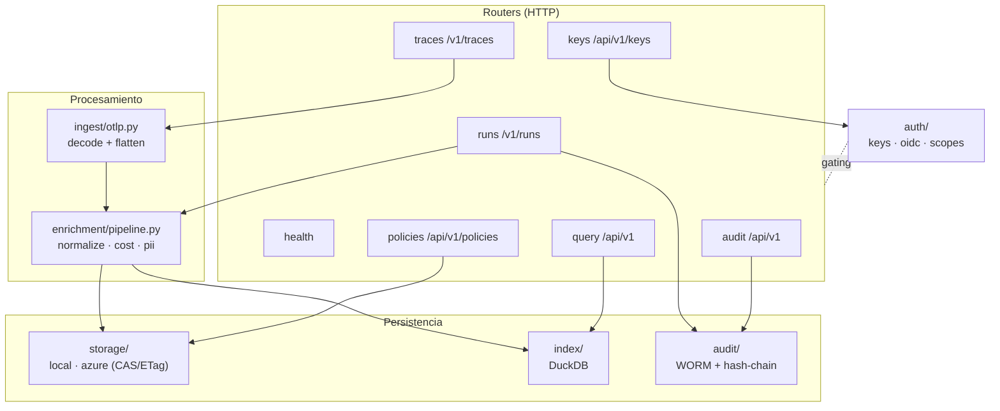

# Arquitectura interna del Collector

El Collector es una app FastAPI organizada en capas claras: **routers** (HTTP) →
**ingest/enrichment** (procesamiento) → **storage/index/audit** (persistencia), con
**auth** transversal. Todo bajo `argox-collector/src/argox_collector/`.

## Capas

### Routers (`routers/`)

Punto de entrada HTTP. Cada router gatea sus endpoints por *scope* vía
`Depends(require_scope(...))`. Handlers de I/O bloqueante son `def` plano (FastAPI los
corre en su threadpool).

| Router | Prefijo | Rol |
|---|---|---|
| `health` | — | `/healthz`, `/readyz` (sin auth). |
| `traces` | `/v1/traces` | Ingesta OTLP. |
| `runs` | `/v1/runs` | Ingesta de run metrics + audit. |
| `policies` | `/api/v1/policies` | CRUD versionado + `/bundle`. |
| `query` | `/api/v1` | Consultas de trazas, métricas y runs (Dashboard). |
| `audit` | `/api/v1` | Lectura/verificación del audit log. |
| `keys` | `/api/v1/keys` | Gestión de API keys (admin). |

### Ingesta (`ingest/`)

`otlp.py` decodifica `ExportTraceServiceRequest` (protobuf o JSON) y aplana la jerarquía
`ResourceSpans → ScopeSpans → Span` en una lista de `SpanRecord` (una fila por span),
fusionando atributos de recurso/scope/span y extrayendo timing, tokens y decisiones de
política. Ver [ingest](ingest.md).

### Enriquecimiento (`enrichment/`)

`pipeline.py` compone etapas: `normalize` (canoniza claves GenAI), `cost` (backfill de
coste desde la tabla de pricing LiteLLM) y `pii` (escaneo de PII residual). Ver
[enrichment](enrichment.md).

### Almacenamiento e índice (`storage/`, `index/`)

- `storage/`: abstracción `StorageBackend` con drivers `local` y `azure`, escrituras
  atómicas y **compare-and-swap (CAS)** por ETag.
- `index/`: abstracción `TraceIndex` con implementación **DuckDB**; promociona campos
  consultables a columnas y sirve las queries del Dashboard.

Ver [storage-and-index](storage-and-index.md).

### Auditoría (`audit/`)

`log.py` mantiene un log **WORM** (Write-Once-Read-Many) append-only segmentado;
`chain.py` encadena los registros con hashes para verificación de integridad. Ver
[audit](audit.md).

### Auth (`auth/`)

Transversal a todos los routers excepto health. Resuelve la identidad (API key o JWT OIDC)
en un `Principal` con un conjunto de `Scope`, y los routers gatean por scope. Ver
[auth](auth.md).

## Estado compartido (`app.state`)

`create_app` adjunta a `app.state`: `settings`, `storage`, `index`, `audit`,
`api_key_store`, `auth`. Los routers acceden vía `request.app.state.*`. Esto permite a los
tests inyectar backends en memoria sin tocar los handlers.

## OpenAPI y cliente del Dashboard

La app fija `generate_unique_id_function = _operation_id`, derivando el `operationId` de
OpenAPI del **nombre del handler** (único entre routers). Así los nombres de método del
cliente TypeScript generado se mantienen estables y el cliente committeado solo cambia
cuando cambia el contrato de verdad. El `openapi.json` generado alimenta el
`openapi-typescript` del Dashboard. Ver [dashboard/data-and-auth](../dashboard/data-and-auth.md).
