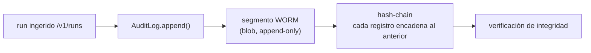

# Audit log WORM

El audit log es el rastro inmutable de Argox para cumplimiento: registra eventos (notablemente
los runs ingeridos y los cambios) de forma **append-only**, con integridad criptográfica
verificable. Vive en `argox-collector/src/argox_collector/audit/`.



## WORM (Write-Once-Read-Many)

`audit/log.py`. Los registros se **añaden**, nunca se modifican ni borran. El log se
**segmenta**: cuando un segmento alcanza `ARGOX_AUDIT_SEGMENT_MAX_RECORDS` (default 1000)
registros, rota a un segmento nuevo. El prefijo de las claves de segmento es
`ARGOX_AUDIT_LOG_PREFIX` (default `audit-log`).

Se apoya en las garantías del storage (escrituras atómicas, CAS) para que los appends sean
seguros bajo concurrencia.

## Cadena de hashes

`audit/chain.py`. Cada registro encadena un hash del registro anterior, formando una
cadena tamper-evident: alterar un registro pasado rompe la cadena y la verificación lo
detecta. Esto da integridad criptográfica sin depender de un almacén externo.

## Reconcile de arranque (COL-14)

Un append WORM puede fallar en una request que por lo demás tuvo éxito (el cliente vio
`200`/`202` y no reintentará). Para no dejar un run sin auditar, el `lifespan` de la app
ejecuta `runs.reconcile_run_audit(...)` al arrancar: barre los runs persistidos que no
estén en el audit log y los cierra. Es **best-effort**: un error de reconcile se loguea
como warning y nunca impide arrancar el servicio.

```python
# app.py (lifespan)
appended = runs.reconcile_run_audit(
    storage=app.state.storage, index=app.state.index, audit=app.state.audit,
)
```

## Acceso

El router `audit` (`/api/v1`, ver [api-reference](api-reference.md)) expone lectura y
verificación del log, gateado por scope. El Dashboard puede usarlo para verificar la
integridad del rastro.

Siguiente: [autenticación](auth.md).
