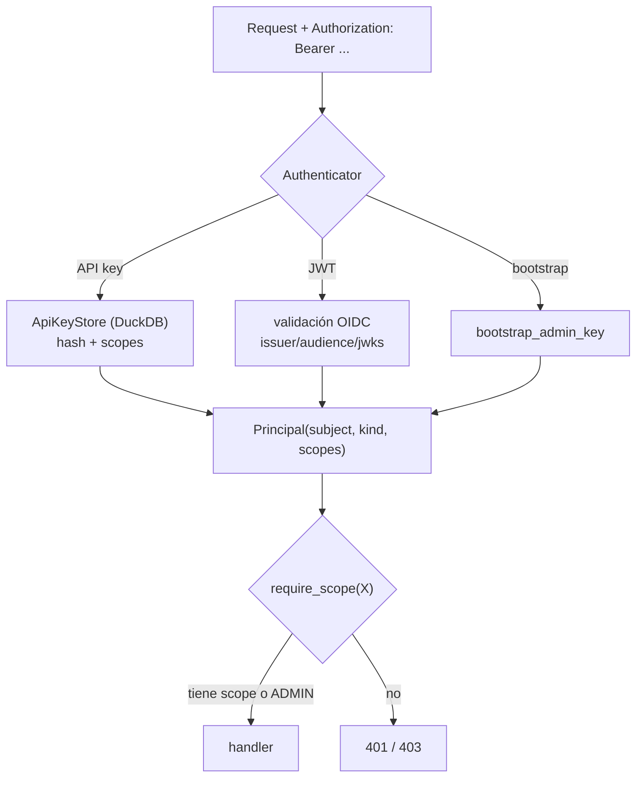

# Autenticación y autorización

El Collector autentica dos familias de clientes y autoriza por **scopes** (COL-09). Todo en
`argox-collector/src/argox_collector/auth/`.

- **API keys** → clientes máquina (SDK: ingesta, lectura de políticas).
- **OIDC / JWT** → usuarios humanos (Dashboard).

Ambos se resuelven a un `Principal` con un conjunto de `Scope`; los routers gatean cada
endpoint con `Depends(require_scope(...))`.



## Scopes (`auth/principal.py`)

```python
class Scope(str, Enum):
    INGEST = "ingest"
    POLICY_READ = "policy-read"
    POLICY_WRITE = "policy-write"
    READ = "read"
    ADMIN = "admin"
```

| Scope | Permite |
|---|---|
| `ingest` | `POST /v1/traces`, `POST /v1/runs`. |
| `policy-read` | Leer políticas y el `/bundle`. |
| `policy-write` | Crear/actualizar/validar/archivar políticas. |
| `read` | Consultas de trazas/métricas/runs (Dashboard). |
| `admin` | **Super-scope**: satisface cualquier comprobación. Necesario para `/api/v1/keys`. |

`Principal.has_scope(scope)` devuelve `True` si el principal tiene ese scope **o** `admin`.
Cuando la auth está deshabilitada, se usa un principal anónimo con `admin` (un solo switch
en vez de casos especiales en cada ruta).

## API keys (`auth/keys.py`, `auth/keystore.py`)

- Las claves se almacenan **hasheadas** en un `ApiKeyStore` respaldado por DuckDB.
- Cada clave lleva sus scopes, un prefijo no secreto para identificarla, autor, fecha y
  expiración opcional; pueden revocarse.
- CRUD admin-only en `/api/v1/keys` (`routers/keys.py`): crear devuelve el secreto **una
  sola vez**; el resto de vistas solo exponen metadatos.

```bash
# crear una key de ingesta (requiere admin)
curl -X POST http://localhost:8000/api/v1/keys \
  -H "Authorization: Bearer $ADMIN_KEY" \
  -H "Content-Type: application/json" \
  -d '{"name":"sdk-prod","scopes":["ingest"],"expires_in":2592000}'
```

### Bootstrap admin key

`ARGOX_BOOTSTRAP_ADMIN_KEY` es una credencial admin *break-glass* aceptada **sin** lookup
en DB. Permite mintear la primera key real por HTTP (el CRUD de keys es admin-only) e
inyectar una credencial admin en despliegues. Déjala sin definir para deshabilitarla.

## OIDC / JWT (`auth/oidc.py`)

Para usuarios del Dashboard. Se habilita cuando los tres parámetros están definidos
(config parcial = deshabilitado):

| Variable | Significado |
|---|---|
| `ARGOX_OIDC_ISSUER` | Issuer del proveedor. Para Microsoft Entra ID: `https://login.microsoftonline.com/<tenant>/v2.0`. |
| `ARGOX_OIDC_AUDIENCE` | Audience esperado en el token. |
| `ARGOX_OIDC_JWKS_URI` | Endpoint de claves JWKS del tenant. |
| `ARGOX_OIDC_ROLE_CLAIM` | Claim que lleva los roles (Entra ID emite `roles`). |
| `ARGOX_OIDC_POLICY_WRITE_ROLE` | Rol que concede `policy-write`. |
| `ARGOX_OIDC_ADMIN_ROLE` | Rol que concede `admin`. |

El RBAC mapea pertenencia a rol → scopes. Sin roles configurados, un usuario no escala más
allá de la línea base de solo lectura (`read` + `policy-read`).

## Master switch

`ARGOX_AUTH_ENABLED` (default `True`, único valor seguro en producción): cuando está
activo, **todo** endpoint salvo `/healthz` y `/readyz` exige una credencial Bearer válida.
La suite de tests lo apaga con `ARGOX_AUTH_ENABLED=false`.

> El host por defecto es `0.0.0.0` (binds para contenedores). Toda la superficie salvo los
> health checks está autenticada, pero aun así conviene poner TLS delante y restringir el
> bind en despliegues no locales.

## Cómo lo usa el Dashboard

El Dashboard maneja **dos tokens**: una *read key* (con `read` + `policy-read`/`policy-write`)
para trazas/métricas/políticas, y una *admin key* aparte solo para gestión de claves. Ver
[dashboard/data-and-auth](../dashboard/data-and-auth.md).

Siguiente: [referencia de la API](api-reference.md).
