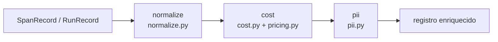
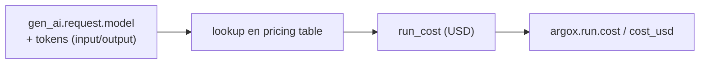

# Enriquecimiento

Antes de persistir, el Collector pasa los registros por un pipeline de enriquecimiento que
normaliza atributos, calcula coste y escanea PII residual. Vive en
`argox-collector/src/argox_collector/enrichment/` y se activa con
`ARGOX_ENRICHMENT_ENABLED` (default `True`).

`pipeline.py` compone las etapas en orden. Cada etapa es independiente y best-effort.

## 1. Normalización (`normalize.py`)

Canoniza las claves de las *GenAI Semantic Conventions*: distintos SDKs/versiones emiten
variantes del mismo concepto (p.ej. nombres alternativos de uso de tokens), y la
normalización las unifica a la forma canónica que el índice espera. Así las queries no
tienen que conocer cada variante.

## 2. Coste (`cost.py` + `pricing.py` + `pricing.yaml`)

Backfill del coste del run (COL-17). El Collector trae un **snapshot committeado de la
tabla de precios de LiteLLM** (`pricing.yaml`, ~22 KB) y un loader cacheado (`pricing.py`).

- Se cruza el modelo (`gen_ai.request.model`) y los tokens con la tabla de pricing para
  calcular `run_cost`.
- Se puede sustituir la tabla en runtime con `ARGOX_PRICING_TABLE_PATH`; el snapshot
  bundled se regenera con `argox-collector refresh-pricing`.
- El coste se promociona a columna consultable (`cost_usd` en el run, `argox.run.cost` en
  el span), alimentando la pantalla de métricas de coste del Dashboard.

## 3. PII residual (`pii.py`)

Escaneo defensivo de PII que pudiera haber escapado a los processors del SDK. Detecta y
enmascara PII residual en los registros antes de persistirlos, como segunda línea de
defensa server-side (la primera es la redacción en el borde, en el SDK; ver
[processors del SDK](../sdk/processors.md)).

## Notas

- El enriquecimiento es **best-effort**: un fallo en una etapa no debe tumbar la ingesta.
- Se aplica tanto a la ruta de trazas como a la de runs (el coste es especialmente
  relevante en runs).
- Desactivarlo (`ARGOX_ENRICHMENT_ENABLED=false`) hace que los registros se persistan tal
  cual llegan (sin coste calculado ni PII residual enmascarada).

Siguiente: [almacenamiento e índice](storage-and-index.md).
