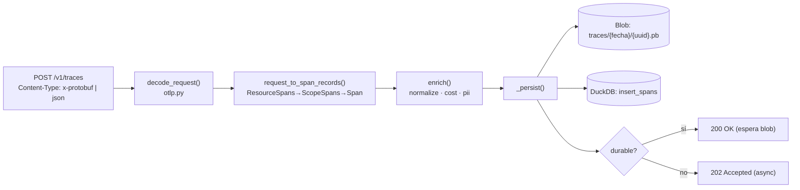
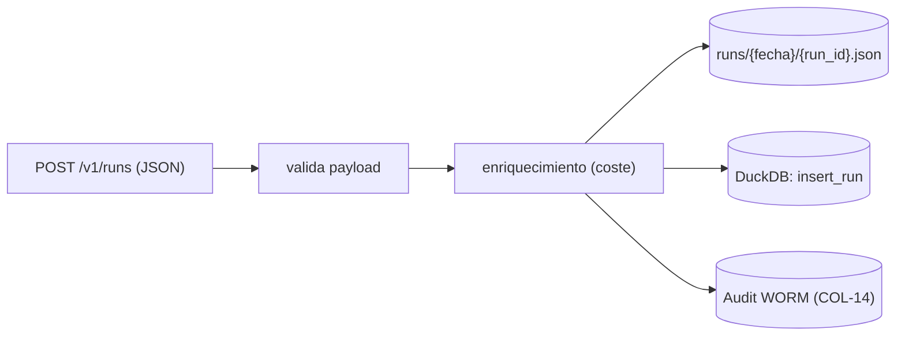

# Ingesta

El Collector recibe datos por dos rutas independientes: **trazas** (spans OTLP) en
`/v1/traces` y **runs** (métricas de run) en `/v1/runs`.

## Ruta A — `POST /v1/traces` (OTLP)

`routers/traces.py` + `ingest/otlp.py`. Recibe un `ExportTraceServiceRequest` de
OpenTelemetry (protobuf o JSON).

Pasos:

1. **Decode** (`decode_request`): valida el content-type, decodifica protobuf o normaliza
   los IDs hex de la variante JSON a base64. Un fallo lanza `OtlpDecodeError` → `400`.
2. **Flatten** (`request_to_span_records`): aplana `ResourceSpans → ScopeSpans → Span` en
   `SpanRecord`, fusionando atributos jerárquicamente y extrayendo timing, tokens y
   decisiones de política. Cada `SpanRecord` es una fila del índice.
3. **Enrich** (`enrich`): normaliza convenciones GenAI, backfill de coste, escaneo de PII
   residual. Ver [enrichment](enrichment.md).
4. **Persist** (`_persist`): escribe el blob crudo del batch en
   `traces/{YYYY-MM-DD}/{uuid}.pb` e inserta las filas `SpanRecord` en DuckDB.
5. **Respuesta** según durabilidad (ver abajo).

Requiere scope `ingest`. Devuelve un `ExportTraceServiceResponse` (protobuf o JSON).

### Modos de durabilidad

| Modo | Header | Respuesta | Semántica |
|---|---|---|---|
| **Async** (default) | — | `202 Accepted` | La persistencia se encola en una tarea de fondo; respuesta inmediata. |
| **Durable** | `X-Argox-Durable: true` | `200 OK` | Espera a que el blob esté escrito antes de responder. |

El `HttpRunExporter` y los clientes que necesiten garantía de escritura piden el modo
durable. Decisión registrada en el ADR-0002 (acknowledgement de ingesta).

## Ruta B — `POST /v1/runs`

`routers/runs.py`. Acepta un `AgentRunMetrics` serializado (un run o un batch), tal como lo
produce `HttpRunExporter` (`AgentRunMetrics.to_dict()`).

- **Storage**: guarda el run en `runs/{YYYY-MM-DD}/{run_id}.json`.
- **Index**: lo indexa como `RunRecord` en DuckDB.
- **Audit**: lo añade al audit log WORM. Si el append WORM falla en una request por lo
  demás exitosa, el reconcile de arranque lo cierra después (COL-14).

El `trace_id` del run permite unirlo con su traza:
`GET /api/v1/runs/by-trace/{trace_id}` (lo usa el *Run Record* del Dashboard).

## Límite de payload

El middleware `PayloadSizeLimitMiddleware` rechaza con `413` cualquier cuerpo que supere
`ARGOX_MAX_PAYLOAD_SIZE` (default 10 MiB) **antes** de bufferizarlo por completo, acotando
el uso de memoria ante subidas concurrentes o maliciosas.

Siguiente: [enriquecimiento](enrichment.md).
