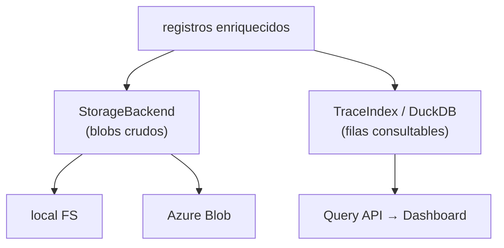

# Almacenamiento e índice

El Collector separa dos responsabilidades de persistencia: el **storage** guarda blobs
crudos (trazas, runs, políticas, audit), y el **índice** (DuckDB) guarda filas
consultables que alimentan el Dashboard.



## Storage (`storage/`)

Abstracción `StorageBackend` (`storage/base.py`) con dos drivers, construidos por
`build_storage(settings)` según `ARGOX_STORAGE_BACKEND`:

| Driver | Archivo | Uso |
|---|---|---|
| `local` | `storage/local.py` | Dev/CI. Escribe en `ARGOX_STORAGE_LOCAL_ROOT` (default `./var/argox/blobs`). |
| `azure` | `storage/azure.py` | Producción. Requiere `ARGOX_STORAGE_AZURE_CONNECTION_STRING`; container `ARGOX_STORAGE_AZURE_CONTAINER`. |

### Interfaz

```python
class StorageBackend(ABC):
    def put(key, data, content_type, metadata=None, expected_etag=None): ...
    def get(key) -> StoredBlob: ...
    def list(prefix) -> Iterator: ...
    def delete(key): ...
    def exists(key) -> bool: ...
    def health_check(): ...
```

### Garantías

- **Escrituras atómicas**: `os.replace()` en local; SDK de Azure con `overwrite=False`.
- **Compare-and-swap (CAS)**: el parámetro `expected_etag` permite escrituras
  condicionales. Es el mecanismo que usa el versionado de políticas para commits seguros
  bajo concurrencia (`expected_etag` del manifest, o `"*"` create-only). Una carrera
  perdida lanza `ConditionNotMetError`. Ver [ciclo de vida de políticas](../policies/lifecycle.md).
- **Content-addressing** (políticas): clave derivada del hash del contenido → overwrites
  idempotentes.

### Layout de claves

| Tipo | Clave |
|---|---|
| Trazas (batch crudo) | `traces/{YYYY-MM-DD}/{uuid}.pb` |
| Runs | `runs/{YYYY-MM-DD}/{run_id}.json` |
| Políticas | `policies/{policy_id}/{content_hash}.yaml` + `policies/manifest.json` |
| Audit | `{audit_log_prefix}/...` (segmentos WORM) |

## Índice DuckDB (`index/`)

Abstracción `TraceIndex` (`index/base.py`) con implementación DuckDB
(`index/duckdb.py`), construida por `build_index(settings)`. Backend único in-tree:
`ARGOX_INDEX_BACKEND=duckdb`, ruta `ARGOX_INDEX_DUCKDB_PATH` (default
`./var/argox/index.duckdb`).

### Qué indexa

- **`SpanRecord`**: una fila por span. Campos consultables promovidos a columnas
  (`agent_name`, `agent_version`, `policy_decision`, `run_cost`, `run_success`,
  `trace_id`, timing, tokens…).
- **`RunRecord`**: una fila por run (coste, éxito, tools, violaciones de política…).

### Capacidades de consulta

`index/duckdb.py` y `routers/query.py` exponen:

| Operación | Para |
|---|---|
| `list_traces()` | Listado paginado de trazas (filtros: agente, status, decisión). |
| `get_trace(trace_id)` | Spans de una traza (waterfall). |
| `get_metrics_cost()` / `_latency()` / `_success()` | Agregados para las tarjetas de métricas. |
| `insert_spans()` / `insert_run()` | Ingesta en batch. |

Estas consultas alimentan directamente las pantallas del Dashboard (ver
[dashboard/screens](../dashboard/screens.md)). La promoción de atributos OTel `argox.*` a
columnas es lo que hace consultables las decisiones de política y el coste.

Siguiente: [audit log](audit.md).
