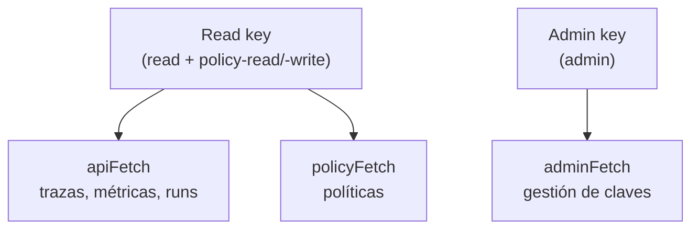
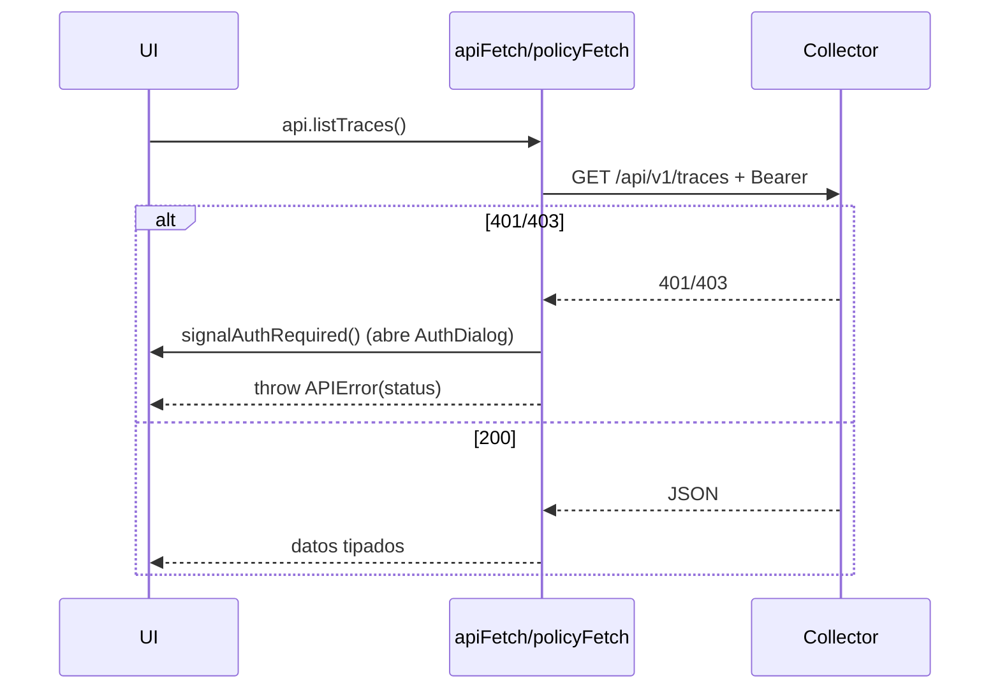

# Datos y autenticación

El Dashboard no tiene backend propio: consume `/api/v1` del **Collector** con un cliente
TypeScript tipado. La lógica de fetch y auth vive en `argox-dashboard/src/lib/`.

## Cliente generado desde OpenAPI

Los tipos de la API (`src/api/schema.ts`) se **generan** desde el `openapi.json` del
Collector con `openapi-typescript`:

```bash
pnpm run gen:api     # genera src/api/schema.ts
pnpm run check:api   # diffea el committeado contra el regenerado (CI)
```

`src/lib/api.ts` reexporta tipos clave del schema (`PolicyRule`, `PolicyResponse`,
`PolicySummary`) y define DTOs de las queries (`TraceSummary`, `SpanDetail`, `RunDetail`,
métricas de coste/latencia/éxito…). El objeto `api` agrupa todos los métodos
(`listTraces`, `getTrace`, `getRunByTrace`, `getCostMetrics`, `listPolicies`,
`createPolicy`, `listKeys`, …).

## Modelo de dos tokens

El Dashboard maneja **dos credenciales** separadas, ambas almacenadas en `localStorage`
(`src/lib/auth.ts`):



| Token | Scopes | Wrapper | Usado por |
|---|---|---|---|
| **Read key** | `read` + `policy-read`/`policy-write` | `apiFetch`, `policyFetch` | Trazas, métricas, runs, políticas. |
| **Admin key** | `admin` | `adminFetch` | Solo gestión de claves (`/keys`). |

### Tres wrappers de fetch

`src/lib/api.ts` define tres wrappers sobre `fetch`, todos contra `API_BASE = '/api/v1'`:

- **`apiFetch`** — adjunta la read key como `Authorization: Bearer`. En `401`/`403` dispara
  `signalAuthRequired()` (abre el diálogo de read key) y lanza `APIError` con el status.
- **`policyFetch`** — como `apiFetch` (la read key también lleva `policy-read`/`policy-write`),
  pero soporta body, `Accept` custom (vista YAML) y devuelve el `Response` crudo. Las
  llamadas de política antes usaban `fetch` pelado sin `Authorization`, por lo que daban
  `401` con auth activada — este wrapper lo corrige (DASH-07).
- **`adminFetch`** — adjunta la **admin key** y **no** dispara `signalAuthRequired` en
  `401`/`403` (ese evento abre el diálogo de read key, prompt equivocado aquí); la pantalla
  de claves maneja el fallo inline. Soporta body y devuelve `null` en `204`.

### Manejo de errores de auth



Cuando no hay token almacenado (p.ej. Collector con auth deshabilitada), las llamadas salen
sin `Authorization` y funcionan igual.

## Relación con los scopes del Collector

El modelo de dos tokens refleja los scopes del Collector (ver
[auth](../collector/auth.md)): la read key cubre el día a día del observador, y la admin key
se reserva para mintear/revocar claves. El tipo `KeyScope` del cliente
(`'read' | 'ingest' | 'policy-read' | 'policy-write' | 'admin'`) refleja exactamente el
enum `Scope` del Collector.
