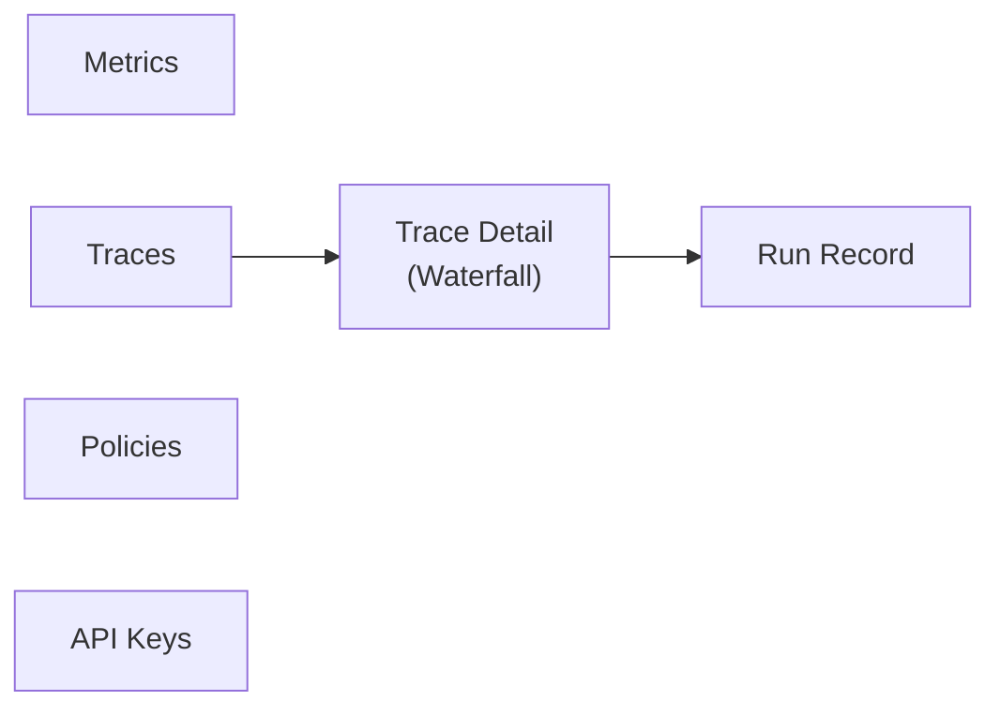

# Pantallas

Las pantallas viven en `argox-dashboard/src/components/screens/`. La navegación
(Sidebar/Header) las enlaza; el shell aplica filtros globales de tiempo, entorno y agente.

## Metrics (`MetricsScreen.tsx`)

Dashboards de **coste, latencia y tasa de éxito** en el tiempo. Consume
`/metrics/cost`, `/metrics/latency`, `/metrics/success` con `window_hours` (24h/7d/30d):

- **Coste**: total, timeline por modelo, top agentes por gasto.
- **Latencia**: media, p95, histograma y percentiles (p50/p95/p99).
- **Éxito**: tasa de éxito, timeline y **top tools bloqueadas** por política.

## Traces (`TracesScreen.tsx`)

Lista paginada de trazas con filtros: agente, status (`ok`/`error`) y **decisión de
política** (`allow`/`block`/`warn`). Consume `/traces`. Cada fila resume agente, duración,
coste, nº de spans y status; al abrir lleva al detalle.

## Trace Detail + Waterfall (`TraceDetailScreen.tsx`, `Waterfall.tsx`)

Visualización **waterfall** de los spans de una traza: jerarquía y duración por span
(`/traces/{trace_id}`). Aquí se ven los spans `execute_tool`, incluidas las tools
**bloqueadas** por política (span placeholder con `policy_decision=block`). Desde el detalle
se navega al *Run Record* asociado.

## Run Record (`RunRecord.tsx`)

Métricas detalladas de un run (`/runs/by-trace/{trace_id}`): tokens (totales y por llamada),
tools disponibles/llamadas/bloqueadas, coste, modelo, prompt y salida final, y
**violaciones de política** (`policies.violations`, `input_passed`/`output_passed`). Es la
contraparte de `AgentRunMetrics.to_dict()` del SDK.

## Policies (`PoliciesScreen.tsx`)

Interfaz CRUD de políticas con **editor YAML Monaco**: listar, ver versiones, validar
(`/policies/validate`), crear y actualizar. Escribir y publicar aquí actualiza las
políticas que los SDK recogen del `/bundle` en segundos. Requiere una key con
`policy-read`/`policy-write`. Ver [ciclo de vida de políticas](../policies/lifecycle.md).

## API Keys (`KeysScreen.tsx`)

Panel **admin** para crear, listar y revocar API keys (`/keys`). La creación muestra el
secreto **una sola vez**. Usa el token admin separado. Ver
[auth del Collector](../collector/auth.md).

## Mapeo pantalla → endpoint

| Pantalla | Endpoints |
|---|---|
| Metrics | `/metrics/cost`, `/metrics/latency`, `/metrics/success` |
| Traces | `/traces` |
| Trace Detail | `/traces/{trace_id}` |
| Run Record | `/runs/by-trace/{trace_id}` |
| Policies | `/policies`, `/policies/{id}`, `/policies/{id}/v{n}`, `/policies/validate` |
| API Keys | `/keys` |

Detalle de cómo se autentican estas llamadas: [data-and-auth](data-and-auth.md).
