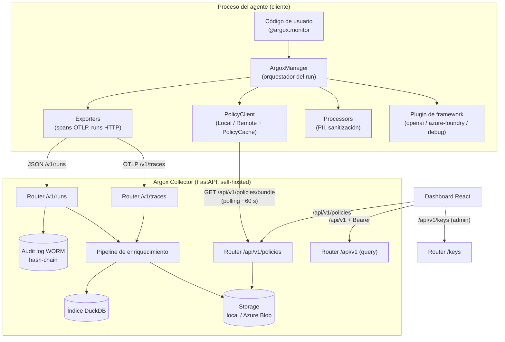

# Arquitectura del sistema

Argox se divide en tres componentes desplegables de forma independiente. La frontera de
confianza es clara: el **SDK** vive en el proceso del agente (zona del cliente) y el
**Collector** + **Dashboard** viven en infraestructura propia del operador.

## Principios de diseño

Estos principios (definidos en el `README.md` raíz) condicionan toda la arquitectura:

| Principio | Implicación técnica |
|---|---|
| **Bajo overhead** | La evaluación de políticas usa una caché local (`PolicyCache`) con predicados precompilados; presupuesto < 200 µs por evaluación, **cero red en el hot-path**. |
| **Fail-open por defecto** | Si la infraestructura se degrada, el agente sigue. El enforcement estricto (fail-closed) es opt-in y explícito. |
| **Self-hosted primero** | Todo el stack corre en infraestructura del operador. Sin SaaS, sin phone-home, sin telemetría por defecto. |
| **Soberanía del dato** | Los datos sensibles se redactan en el borde (processors) antes de salir del proceso. El audit log es append-only con integridad criptográfica. |

## Los tres componentes

### 1. SDK — `argox-core` (+ plugins, exporters)

Paquete Python que se integra en el código del agente mediante el decorador
`@argox.monitor`. Responsabilidades:

- **Instrumentar** la ejecución del framework (vía plugin) y abrir el span raíz
  `argox.agent.run`.
- **Aplicar políticas** en tres puntos del ciclo (input, tool-call, output).
- **Transformar datos in-flight** con processors (p.ej. redacción de PII).
- **Exportar** spans (OpenTelemetry/OTLP) y métricas de run (HTTP) al Collector.

Se detalla en [SDK](../sdk/README.md). El núcleo (`argox-core`) no depende de ningún
framework concreto: cada integración es un paquete `argox-plugin-<framework>` que se
descubre por entry-points.

### 2. Collector — `argox-collector`

Servicio **FastAPI** (uvicorn) que actúa como servidor de ingesta, indexado y
distribución de políticas. No es un exporter: recibe, enriquece, almacena y sirve.
Capas:

- **Ingesta**: `/v1/traces` (OTLP/HTTP) y `/v1/runs` (métricas de run).
- **Enriquecimiento**: normalización GenAI, backfill de coste, escaneo de PII residual.
- **Almacenamiento**: blobs (local o Azure) + índice **DuckDB** para consultas.
- **Auditoría**: log WORM append-only con cadena de hashes.
- **Auth**: API keys (clientes SDK) + OIDC/JWT (usuarios del dashboard), por *scopes*.
- **Políticas**: CRUD versionado content-addressed y endpoint `/bundle` para los SDK.

Se detalla en [Collector](../collector/README.md).

### 3. Dashboard — `argox-dashboard`

SPA **React 19 + Vite + TypeScript + Tailwind v4** (gestor `pnpm`). Consume `/api/v1`
del Collector con un cliente TypeScript generado desde el `openapi.json`. Pantallas:
métricas, trazas, detalle de traza (waterfall), run record, políticas (editor YAML
Monaco) y gestión de claves. Se detalla en [Dashboard](../dashboard/README.md).

## Contratos entre componentes

| Productor | Consumidor | Contrato | Transporte |
|---|---|---|---|
| SDK exporter | Collector | Spans OTel | OTLP/HTTP (protobuf o JSON) → `POST /v1/traces` |
| SDK exporter | Collector | `AgentRunMetrics` | JSON → `POST /v1/runs` |
| Collector | SDK `RemotePolicyClient` | `PolicyDocument` mergeado | YAML → `GET /api/v1/policies/bundle` |
| Collector | Dashboard | DTOs de query/policies/keys | JSON → `/api/v1/*` (OpenAPI) |

La identidad OTel cohesiona todo: el `trace_id` del span raíz `argox.agent.run` se graba
también en `AgentRunMetrics.trace_id`, de modo que el Collector puede unir un run con su
traza (`GET /api/v1/runs/by-trace/{trace_id}`).

Continúa en [Flujo de datos](data-flow.md).
