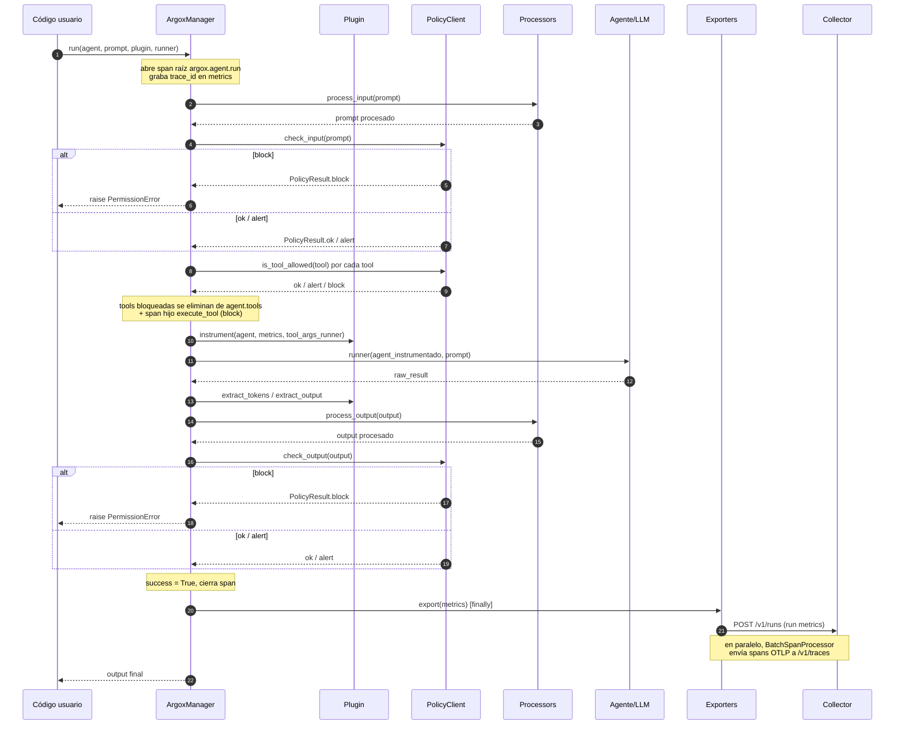
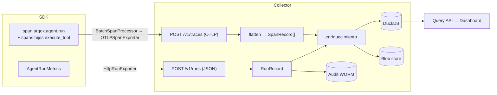

# Flujo de datos: ciclo de vida de un run

Esta página sigue una llamada de agente de principio a fin, atravesando SDK y Collector.
La secuencia está modelada en `ArgoxManager.run()`
(`argox-project/argox-core/src/argox/core/manager.py`).

## Secuencia completa

## Fases del run (orden exacto)

`ArgoxManager.run()` ejecuta estos pasos dentro de un único span
`argox.agent.run`. Cuando `enable_phase_timings=True`, cada fase se cronometra en
`metrics.phase_timings` (ms):

1. **`processors_input`** — `process_input` de cada processor sobre el prompt.
2. **`policy_input`** — `check_input`. Si bloquea → `PermissionError`. Si alerta →
   se registra y el run continúa.
3. **`tool_filter`** — `is_tool_allowed` por cada tool. Las bloqueadas se eliminan de
   `agent.tools` y se emite un span hijo `execute_tool <tool>` con
   `argox.policy.decision=block` (para que la decisión sea consultable por tool).
4. **`agent_exec`** — el plugin instrumenta una **copia por-run** del agente y se ejecuta
   el `runner`. El `tool_args_runner` permite a los processors mutar argumentos de tool.
5. **Extracción** — `extract_tokens` y `extract_output` del plugin; se graban
   `gen_ai.usage.input_tokens` / `output_tokens` en el span.
6. **`processors_output`** — `process_output` sobre la salida.
7. **`policy_output`** — `check_output`. Mismas semánticas que input.
8. **`export`** (`finally`) — se marca `argox.run.success`, se restaura el agente
   compartido y se invoca `export(metrics)` en cada exporter (los errores se acumulan en
   `metrics.exporter_errors`, nunca abortan el run).

> **Aislamiento de concurrencia:** el manager instrumenta una copia *shallow* del agente
> (`_prepare_run_agent`) en lugar de mutar la instancia compartida, porque el mismo
> objeto `Agent` suele ser conducido por `run()` concurrentes. Ver issue #153 en el
> devlog.

## Del SDK al Collector

Dos rutas independientes llevan datos al Collector:

- **Ruta A (trazas):** el `BatchSpanProcessor` de OpenTelemetry envía los spans vía
  OTLP a `/v1/traces`. El Collector los aplana en `SpanRecord` (una fila por span),
  enriquece y persiste el blob crudo + índice.
- **Ruta B (runs):** el `HttpRunExporter` envía el `AgentRunMetrics` serializado a
  `/v1/runs`. Se indexa como `RunRecord` y se añade al audit log WORM.

El `trace_id` común permite al Dashboard cargar, desde una traza, su run asociado
(`GET /api/v1/runs/by-trace/{trace_id}`), y desde un run, su waterfall de spans.

## Modos de durabilidad de la ingesta

`POST /v1/traces` soporta dos modos (ver [ingesta](../collector/ingest.md)):

- **Por defecto (`202 Accepted`)**: el Collector encola la persistencia en una tarea de
  fondo y responde de inmediato. Menor latencia para el SDK.
- **Durable (`X-Argox-Durable: true` → `200 OK`)**: el Collector espera a que el blob
  esté escrito antes de responder. El `HttpRunExporter` puede pedir este modo.

Detalle de las decisiones: [`policies/evaluation.md`](../policies/evaluation.md) para el
enforcement y [`collector/ingest.md`](../collector/ingest.md) para la persistencia.
