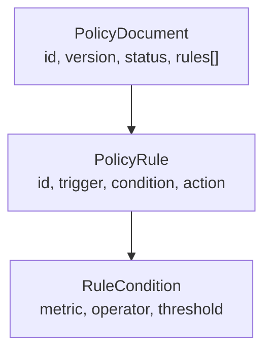

# Sistema de políticas

El sistema de políticas es el motor de **gobernanza** de Argox: define, en YAML,
qué entradas, herramientas y salidas están permitidas, y qué hacer cuando una regla se
cumple (bloquear, alertar o permitir). Las políticas se evalúan **dentro del proceso del
agente**, en el *hot-path*, sin llamadas de red.

## Modelo mental

Una **política** (`PolicyDocument`) es un documento YAML con un `id`, una `version` y una
lista de **reglas** (`PolicyRule`). Cada regla tiene:

- un **trigger**: en qué momento del run se evalúa (`on_input`, `on_tool_call`, `on_output`);
- una **condición** (`metric` + `operator` + `threshold`): qué comprueba;
- una **acción** (`block`, `alert`, `ok`): qué hacer si la condición se cumple.



Ejemplo mínimo:

```yaml
id: mi-politica
version: 1
status: active
rules:
  - id: IN-01
    trigger: on_input
    condition: { metric: prompt, operator: contains, threshold: nuke-the-prod }
    action: block
```

Esa regla dice: *"cuando el prompt contenga `nuke-the-prod`, bloquea el run"*.

## Dónde vive cada pieza

| Pieza | Archivo | Rol |
|---|---|---|
| Esquema + parser | `argox-core/src/argox/policies/parser.py` | Modelos Pydantic, validación, compilación de condiciones a predicados. |
| Caché hot-path | `argox-core/src/argox/policies/cache.py` | Indexa reglas por trigger, evalúa en O(1). |
| Interfaz + resultado | `argox-core/src/argox/interfaces/policy.py` | `PolicyClient`, `PolicyResult`, constantes de trigger. |
| Cliente local | `argox-core/src/argox/policies/local_client.py` | Carga un YAML de disco (dev/test), fail-closed. |
| Cliente remoto | `argox-core/src/argox/policies/remote_client.py` | Polling del bundle del Collector (prod), fail-open. |
| Enforcement | `argox-core/src/argox/core/manager.py` | Aplica las decisiones en el ciclo de run. |
| API del Collector | `argox-collector/src/argox_collector/routers/policies.py` | CRUD versionado + `/bundle`. |

## Dos lados, un mismo esquema

El **esquema de políticas está duplicado intencionadamente** en el SDK
(`policies/parser.py`) y en el Collector (`routers/policies.py`), y ambos deben coincidir:

- El **SDK** parsea y evalúa políticas (consumidor).
- El **Collector** valida, versiona y sirve políticas (autoridad/almacén).

El Collector nunca evalúa políticas contra runs: solo las **almacena y distribuye**. El
enforcement ocurre siempre en el SDK, en el borde, junto al agente.

## Recorrido de la documentación

1. [Referencia de reglas](reference.md) — todos los triggers, operadores, acciones y
   campos soportados, con la semántica exacta del código.
2. [Evaluación y enforcement](evaluation.md) — dónde y cómo se aplican las decisiones;
   `LocalPolicyClient` vs `RemotePolicyClient`; fail-open/fail-closed.
3. [Ciclo de vida y versionado](lifecycle.md) — CRUD del Collector, versionado
   content-addressed, manifest/CAS y endpoint `/bundle`.
4. [Guía de uso](usage-guide.md) — escribir, validar, desplegar y conectar políticas
   paso a paso.
