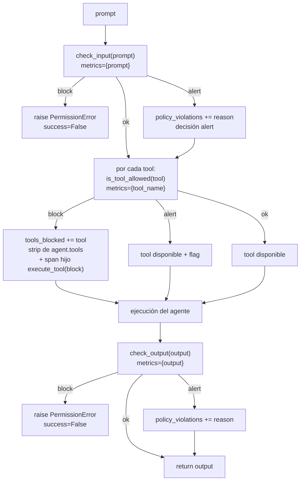
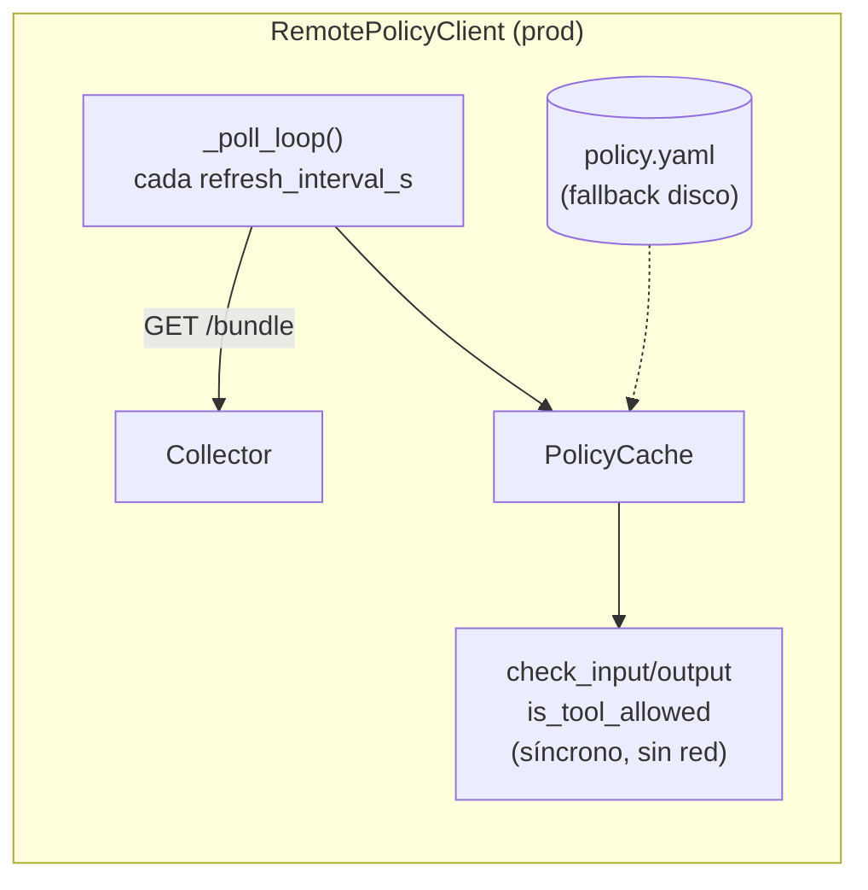

# Evaluación y enforcement

Las políticas se **almacenan** en el Collector pero se **evalúan en el SDK**, en el
proceso del agente. Esta página explica los tres puntos de enforcement, cómo se traduce
un `PolicyResult` en comportamiento, y las diferencias entre el cliente local y el remoto.

## Los tres puntos de enforcement

Todo el enforcement vive en `ArgoxManager.run()`
(`argox-core/src/argox/core/manager.py`). El `PolicyClient` es opcional: si es `None`,
todas las comprobaciones se omiten silenciosamente.



### 1. Input (`check_input`)

```python
result = await self._policy.check_input(processed_prompt)
if not result.passed:                       # block
    metrics.input_policy_passed = False
    metrics.policy_violations.append(result.reason)
    _record_policy_block(span, result.rule_id, "input policy blocked")
    record_policy_decision(decision="block", rule_id=result.rule_id)
    raise PermissionError(f"[POLICY:{result.rule_id}] {result.reason}")
if result.rule_id:                          # alert
    metrics.policy_violations.append(result.reason)
    record_policy_decision(decision="alert", rule_id=result.rule_id)
else:                                       # ok
    record_policy_decision(decision="ok", rule_id=None)
```

- **block** → el run aborta con `PermissionError`; el span recibe
  `argox.policy.decision=block`, `argox.policy.rule_id` y status ERROR.
- **alert** → se registra la violación y el run continúa.
- **ok** → se registra la decisión `ok`.

### 2. Filtrado de tools (`is_tool_allowed`)

Se evalúa **por cada tool** antes de instrumentar el agente. Es *pre-flight*: el manager
filtra la lista antes de que el agente la reciba.

- **block** → la tool se añade a `metrics.tools_blocked`, se **elimina** de `agent.tools`
  (`_apply_tool_filter`) y se emite un **span hijo** `execute_tool <tool>` con
  `argox.policy.decision=block`. Ese span placeholder existe porque una tool eliminada no
  produce su propio span: sin él, el bloqueo sería invisible en el waterfall y en las
  métricas de tools bloqueadas (el Collector solo indexa decisiones desde spans).
- **alert** → la tool **se mantiene** disponible pero queda flagged.
- **ok** → la tool se mantiene.

Las tools bloqueadas también se exponen en el atributo de run
`argox.run.blocked_tools`.

### 3. Output (`check_output`)

Idéntico a input pero sobre la salida final, tras los processors de output. Un **block**
aquí lanza `PermissionError` y marca `output_policy_passed = False`.

## Qué queda registrado

Tras el run, `AgentRunMetrics` lleva:

| Campo | Significado |
|---|---|
| `input_policy_passed` | `False` si el input fue bloqueado. |
| `output_policy_passed` | `False` si el output fue bloqueado. |
| `policy_violations: list[str]` | Razones de **todos** los block y alert. |
| `tools_available: list[str]` | Tools permitidas tras el filtrado. |
| `tools_blocked: list[{name, reason}]` | Tools eliminadas por política. |

Y a nivel OpenTelemetry (`semconv/attributes.py`):

| Atributo / evento | Valor |
|---|---|
| `argox.policy.decision` | `ok` / `block` / `alert` |
| `argox.policy.rule_id` | id de la regla que disparó |
| `argox.run.blocked_tools` | lista de tools bloqueadas |
| métrica `argox.policy.decisions` | contador de decisiones (`record_policy_decision`) |

El Collector promociona estos atributos a columnas consultables (ver
[`storage-and-index`](../collector/storage-and-index.md)), y el Dashboard los expone como
filtro `decision: allow | block | warn`.

## `LocalPolicyClient` vs `RemotePolicyClient`

Ambos implementan `PolicyClient` y delegan la evaluación en el mismo `PolicyCache`
síncrono. Difieren en **de dónde** sacan las políticas y en su **resiliencia**.

| Aspecto | `LocalPolicyClient` | `RemotePolicyClient` |
|---|---|---|
| Fuente | Archivo YAML de disco | Endpoint `/api/v1/policies/bundle` del Collector |
| Carga | Una vez en `__init__` (sin hot-reload) | Polling en background cada `refresh_interval_s` (default 60 s) |
| Hot-path | `cache.evaluate(...)` | `cache.evaluate(...)` (cero red) |
| Error de **evaluación** | Fail-closed → `block` (`system_error`) | Fail-closed → `block` (`evaluation_error`) |
| Error de **red/parseo** | n/a (no hay red) | Fail-open → retiene la última política conocida, loguea warning |
| Caché en frío | n/a | Eager fetch en `start()`; opcional fallback a disco (`policy_cache_dir`) |
| Uso típico | Desarrollo y tests | Producción |



### Semánticas de fallo del cliente remoto

Definidas en `remote_client.py`:

- **Fallo de polling** (red caída, error de parseo): *fail-open*. Se conserva la última
  política válida y se loguea un warning; el servicio no se interrumpe. Si el eager fetch
  inicial falla, la caché queda vacía y **todas las evaluaciones pasan** (no hay reglas)
  hasta que un fetch tenga éxito.
- **Fallo de evaluación** (un predicado lanza): *fail-closed*. Devuelve
  `PolicyResult.block(rule_id="evaluation_error")` para no permitir por defecto ante un
  error de sistema.
- **Persistencia a disco**: si se configura `policy_cache_dir`, cada bundle recibido se
  escribe con rename atómico a `policy.yaml`, y se recarga en arranque en frío (issue #40).

### Ciclo de vida del cliente remoto

```python
client = RemotePolicyClient(
    endpoint_url="https://collector/api/v1/policies/bundle",
    refresh_interval_s=60,
    policy_cache_dir="/var/cache/argox",   # opcional, fallback de disco
    api_key="sk-...",                      # requerido si el Collector exige policy-read
)
await client.start()   # eager fetch + arranca el polling en background
# ... usar el agente ...
await client.stop()    # cancela el polling y cierra el cliente HTTP
```

> Si se pasa `api_key` pero el endpoint no es HTTPS, el cliente emite un warning porque
> la clave viajaría en claro (`is_plaintext_credential_endpoint`).

Siguiente: [cómo el Collector versiona y sirve estas políticas](lifecycle.md).
