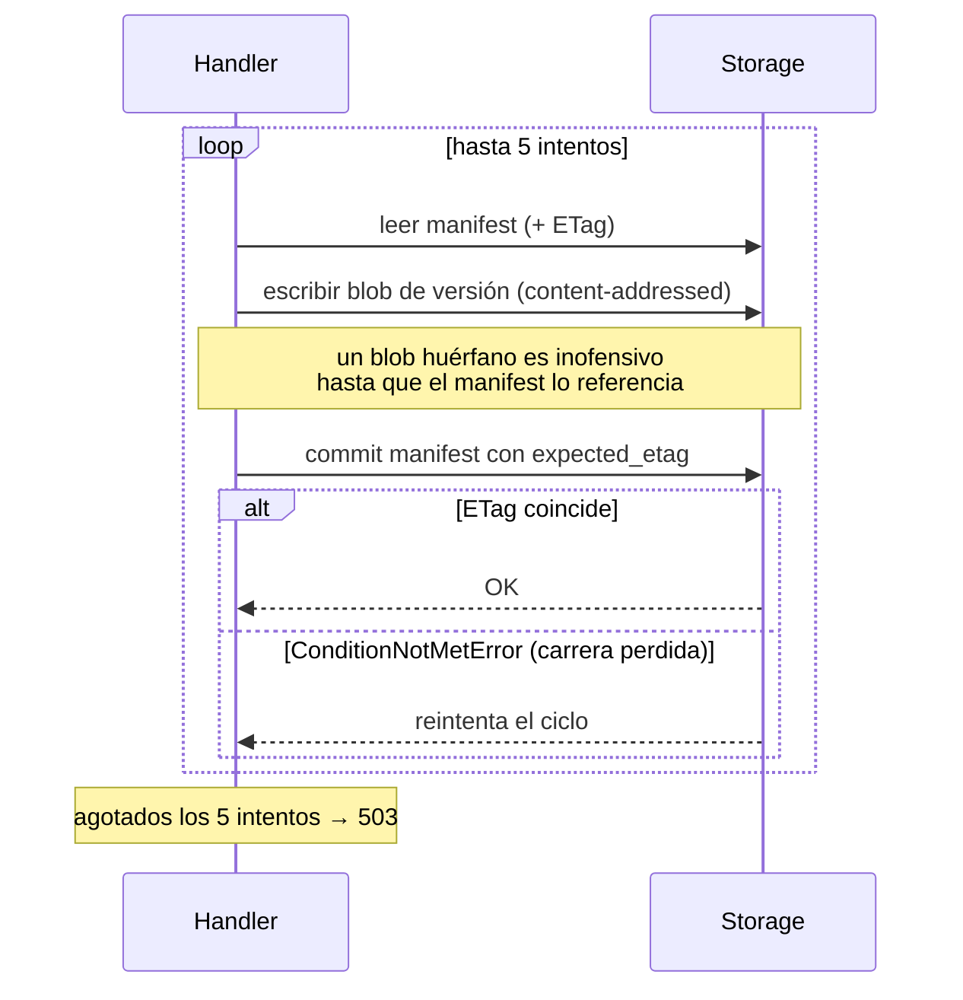
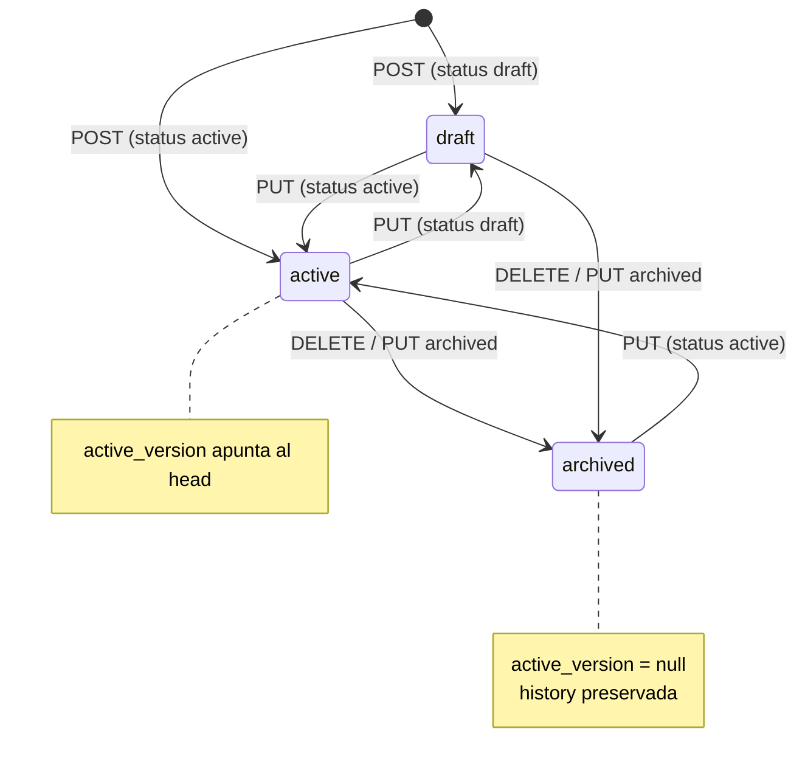

# Ciclo de vida y versionado de políticas

El Collector es la **autoridad** de las políticas: las valida, las versiona de forma
inmutable y las sirve a los SDK. Todo está en
`argox-collector/src/argox_collector/routers/policies.py` (prefijo `/api/v1/policies`).

## Almacenamiento content-addressed + manifest

Cada versión de una política es un documento YAML **inmutable** guardado en una clave
derivada de su propio hash:

```
policies/
├── manifest.json                       # estado y versiones de todas las políticas
├── argox-demo-policy/
│   ├── <sha256-v1>.yaml                # versión 1 (content-addressed)
│   └── <sha256-v2>.yaml                # versión 2
└── otra-politica/
    └── <sha256>.yaml
```

- La clave del blob es `policies/{policy_id}/{content_hash}.yaml`, con
  `content_hash = sha256(yaml)`. Contenido idéntico es **idempotente**; contenido distinto
  aterriza en otra clave, así que **dos escritores nunca se pisan los datos**.
- El **manifest** (`policies/manifest.json`) es la única fuente de verdad sobre qué
  versiones existen y cuál está activa:

```json
{
  "policies": {
    "argox-demo-policy": {
      "status": "active",
      "latest_version": 2,
      "active_version": 2,
      "versions": { "1": "<sha256-v1>", "2": "<sha256-v2>" }
    }
  }
}
```

Un lector **solo confía en el manifest**: una versión existe exactamente cuando el
manifest la referencia. Blobs escritos pero no comprometidos (carreras CAS perdidas) son
basura inalcanzable.

## Protocolo de commit (CAS con ETag)

Toda mutación sigue el mismo protocolo, con reintentos (`_CAS_ATTEMPTS = 5`):



1. **Escribe el blob de versión primero.** Un blob huérfano (crash o carrera perdida) es
   basura inofensiva: inalcanzable hasta que el manifest lo referencie.
2. **Commit del manifest con escritura condicional** (`expected_etag`): el ETag leído para
   updates, o el centinela `"*"` (create-only) si el manifest no existía. Una carrera
   perdida lanza `ConditionNotMetError` y se reintenta el ciclo read-build-commit.
3. Tras 5 intentos fallidos → `503 too many concurrent policy updates`.

## Estados y transiciones



| Operación | Endpoint | Efecto |
|---|---|---|
| Crear | `POST /policies` | Crea versión 1. Default `status: draft`. |
| Actualizar | `PUT /policies/{id}` | Crea versión n+1. `active_version` sigue al head si `active`, si no se limpia. |
| Archivar | `DELETE /policies/{id}` | Crea una versión `archived` copiando las reglas del head. Idempotente. Nada se borra. |

Semántica clave de `active_version`:

- Se fija solo cuando `status == "active"`, y siempre apunta a la **última** versión.
- Pasar a `draft` o `archived` lo pone a `null`.
- Una política sin `active_version` (draft o archived) devuelve **404** en
  `GET /policies/{id}` y **se omite** en el bundle: un cliente nunca confunde un documento
  retirado con uno aplicable.

## Endpoint `/bundle`

`GET /api/v1/policies/bundle` es lo que consume el `RemotePolicyClient`. Mergea las reglas
de **todas las políticas activas** (ordenadas por id) en un único `PolicyDocument`:

```yaml
id: bundle_active
version: 1
status: active
rules:
  - ...   # reglas de la política A (active_version)
  - ...   # reglas de la política B (active_version)
```

- **Caché por ETag**: el ETag es `sha256` del cuerpo YAML, así que solo cambia cuando
  cambia el conjunto efectivo de reglas. `If-None-Match` que casa responde **304**.
- **Tolerancia a fallos**: si una política activa es ilegible (puntero colgante,
  manifest inconsistente, blob corrupto), se **omite y se loguea**, pero el resto del
  bundle se sirve igual. El bundle es un camino de enforcement de toda la flota: una
  política rota no puede dejar a todos sin reglas.
- **GET idempotente**: el handler nunca escribe, así que es cacheable por proxies.

## Validación (dry-run)

`POST /api/v1/policies/validate` valida YAML contra el esquema **sin persistir**. Usa el
mismo `PolicyParser` del SDK, garantizando que lo que valida el Collector es lo que el SDK
podrá parsear:

```json
// 200 OK
{ "valid": true, "errors": [], "policy": { ... } }
{ "valid": false, "errors": ["Policy validation failed: ..."] }
```

## Resumen de endpoints (scopes)

| Método | Path | Scope | Códigos |
|---|---|---|---|
| `POST` | `/validate` | `policy-write` | 200 |
| `GET` | `` (list) | `policy-read` | 200 |
| `GET` | `/bundle` | `policy-read` | 200, 304 |
| `GET` | `/{id}` | `policy-read` | 200, 404 |
| `GET` | `/{id}/v{n}` | `policy-read` | 200, 404 |
| `POST` | `` | `policy-write` | 201, 409 |
| `PUT` | `/{id}` | `policy-write` | 200, 404, 503 |
| `DELETE` | `/{id}` | `policy-write` | 200, 404, 503 |

`GET /{id}` y `GET /{id}/v{n}` devuelven JSON por defecto, o el YAML crudo si el header
`Accept` pide `application/x-yaml`. Detalle de auth y scopes en
[`collector/auth.md`](../collector/auth.md).

Siguiente: [la guía de uso paso a paso](usage-guide.md).
