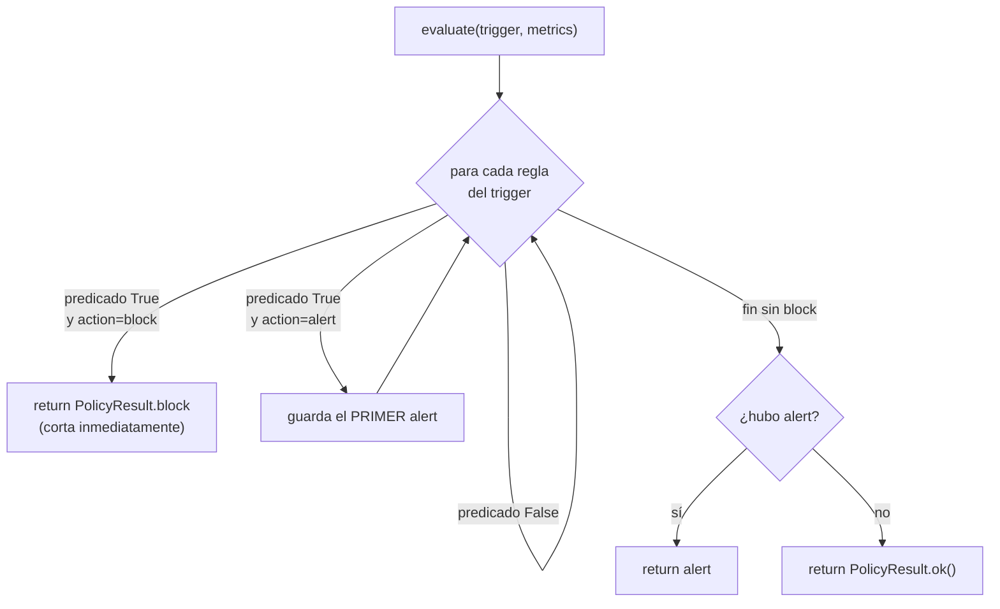

# Referencia completa de reglas

Esta página documenta **todo** lo que el motor de políticas soporta, tal y como está
definido en `argox-core/src/argox/policies/parser.py` (esquema y compilación) y
`argox-core/src/argox/policies/cache.py` (evaluación). No hay reglas fuera de lo aquí
listado: el esquema usa `Literal` de Pydantic, de modo que cualquier valor no enumerado
es rechazado en el parseo.

## Estructura del documento (`PolicyDocument`)

```yaml
id: <string>                 # identificador único de la política
version: <int>               # número de versión
status: active | draft | archived
rules:                       # lista de reglas (máx. 1000)
  - ...
created_by: <string>         # opcional
updated_at: <ISO-8601>       # opcional
```

| Campo | Tipo | Requerido | Notas |
|---|---|---|---|
| `id` | `str` | sí | Identificador de la política. En el Collector debe casar `^[a-zA-Z0-9_-]+$` y no puede ser `bundle` (reservado). |
| `version` | `int` | sí | Versión del documento. La asigna el Collector en cada escritura. |
| `status` | `Literal["active","draft","archived"]` | sí | Solo las `active` con `active_version` entran en el bundle. |
| `rules` | `List[PolicyRule]` | sí | Máximo **1000** reglas por política (`_MAX_RULES_PER_POLICY`). |
| `created_by` | `str \| None` | no | Autor. |
| `updated_at` | `str \| None` | no | Timestamp ISO-8601 de última actualización. |

> Nota: el endpoint de **creación** del Collector (`POST /policies`) usa `status: draft`
> por defecto; el `PolicyDocument` del SDK exige `status` explícito.

## Estructura de regla (`PolicyRule`)

```yaml
- id: <string>               # único dentro de la política
  trigger: on_input | on_tool_call | on_output
  condition:
    metric: <string>
    operator: eq | neq | gt | gte | lt | lte | contains | in
    threshold: <any>
  action: block | alert | ok
  enforcement: strict        # opcional, default "strict"
```

| Campo | Tipo | Requerido | Default | Descripción |
|---|---|---|---|---|
| `id` | `str` | sí | — | Único dentro de la política. En el Collector casa `^[a-zA-Z0-9_-]+$`. Aparece como `rule_id` en las decisiones. |
| `trigger` | `str` | sí | — | Evento que dispara la regla (ver abajo). |
| `condition` | `RuleCondition` | sí | — | Condición a evaluar. |
| `action` | `Literal["block","alert","ok"]` | sí | — | Qué hacer si la condición se cumple. |
| `enforcement` | `str` | no | `"strict"` | Nivel de enforcement. **Se almacena pero no se interpreta** en la v1; reservado para futuro. |

## Condición (`RuleCondition`)

| Campo | Tipo | Requerido | Descripción |
|---|---|---|---|
| `metric` | `str` | sí | Clave a evaluar del diccionario de métricas. Soporta **dot-notation** para diccionarios anidados (`_get_nested_value`). |
| `operator` | `Literal[...]` | sí | Uno de los 8 operadores. |
| `threshold` | `Any` | sí | Valor con el que comparar. El tipo debe encajar con el operador. |

La condición se compila a un predicado `(metrics: dict) -> bool`. **Si la métrica no
existe en el diccionario, el valor es `None` y el predicado devuelve `False`** (la regla
no se dispara). Esto es *fail-open* a nivel de métrica ausente (comportamiento MVP
documentado en `cache.py`).

## Triggers soportados (3)

Cada trigger se evalúa en un punto distinto del run y expone **una** métrica:

| Trigger | Constante | Momento | Métrica disponible | Método del cliente |
|---|---|---|---|---|
| `on_input` | `TRIGGER_ON_INPUT` | Antes de enviar el prompt al LLM | `prompt` (str) | `check_input(text)` |
| `on_tool_call` | `TRIGGER_ON_TOOL_CALL` | Antes de exponer cada tool al agente | `tool_name` (str) | `is_tool_allowed(name)` |
| `on_output` | `TRIGGER_ON_OUTPUT` | Tras recibir la respuesta del LLM | `output` (str) | `check_output(text)` |

Las métricas se construyen en los clientes (`local_client.py` / `remote_client.py`):
`{"prompt": text}`, `{"tool_name": tool_name}`, `{"output": text}`.

> **Importante:** en la v1 cada trigger solo tiene una métrica string. Un `threshold`
> numérico con `gt`/`lt` sobre `prompt`/`output`/`tool_name` no se disparará (compara
> string contra número → en la mayoría de casos `False` o `TypeError` capturado). Los
> operadores numéricos existen en el motor de cara a métricas futuras.

## Operadores soportados (8)

Definidos en el dict `operator_funcs` de `compile_condition`. `a` es el valor de la
métrica; `b` es el `threshold`.

| Operador | Semántica | Implementación | Ejemplo |
|---|---|---|---|
| `eq` | Igualdad | `a == b` | `tool_name eq get_secret` |
| `neq` | Desigualdad | `a != b` | `status neq blocked` |
| `gt` | Mayor que | `a > b` | `tokens gt 1000` |
| `gte` | Mayor o igual | `a >= b` | `cost gte 10.5` |
| `lt` | Menor que | `a < b` | `attempts lt 3` |
| `lte` | Menor o igual | `a <= b` | `latency_ms lte 500` |
| `contains` | Contención | `b in a` si `a` es `list/str/dict`, si no `False` | `prompt contains password` |
| `in` | Pertenencia | `a in b` si `b` es `list/set/tuple`, si no `False` | `tool_name in [rm, kill]` |

```python
# argox-core/src/argox/policies/parser.py
operator_funcs = {
    "eq":  lambda a, b: a == b,
    "neq": lambda a, b: a != b,
    "gt":  lambda a, b: a > b,
    "gte": lambda a, b: a >= b,
    "lt":  lambda a, b: a < b,
    "lte": lambda a, b: a <= b,
    "contains": lambda a, b: b in a if isinstance(a, (list, str, dict)) else False,
    "in":       lambda a, b: a in b if isinstance(b, (list, set, tuple)) else False,
}
```

Cualquier otro operador lanza `ValueError("Unsupported operator: ...")` al compilar — pero
el `Literal` de Pydantic ya lo rechaza antes en el parseo.

## Acciones soportadas (3)

| Acción | Comportamiento en el SDK | Run | Registro |
|---|---|---|---|
| `block` | Detiene la ejecución. En input/output lanza `PermissionError`; en tool-call **elimina la tool** de `agent.tools`. | Falla (input/output) / tool deshabilitada | `policy_violations` + decisión `block` |
| `alert` | La ejecución continúa; la regla queda registrada. | Continúa | `policy_violations` + decisión `alert` |
| `ok` | No-op. Se ignora. | Continúa | — |

## Precedencia de evaluación

`PolicyCache.evaluate(trigger, metrics)` recorre las reglas del trigger en orden y aplica:



Reglas de precedencia:

1. **`block` gana siempre** y corta la evaluación de inmediato (no se siguen evaluando
   más reglas de ese trigger).
2. Si no hay block, se devuelve el **primer `alert`** que haya disparado.
3. Si nada dispara, se devuelve `ok()`.

## `PolicyResult`

Resultado inmutable de toda evaluación (`interfaces/policy.py`):

| Estado | `passed` | `reason` | `rule_id` | Constructor |
|---|---|---|---|---|
| OK | `True` | `""` | `""` | `PolicyResult.ok()` |
| Alert | `True` | mensaje | id de la regla | `PolicyResult.alert(reason, rule_id)` |
| Block | `False` | mensaje | id de la regla | `PolicyResult.block(reason, rule_id)` |

`passed=False` solo en `block`. Un `alert` **pasa** (`passed=True`) pero lleva `rule_id`,
y por eso el manager lo distingue de un `ok` puro.

## Ejemplo de política completa

De `deploy/local/demo_policy.yaml` (sembrada por el demo local):

```yaml
id: argox-local-demo
status: active
created_by: argox-local-demo
rules:
  # Input — evaluado contra el prompt antes del LLM
  - id: LOCAL-IN-01            # intención destructiva
    trigger: on_input
    condition: { metric: prompt, operator: contains, threshold: nuke-the-prod }
    action: block
  - id: LOCAL-IN-02            # intento de SQL injection
    trigger: on_input
    condition: { metric: prompt, operator: contains, threshold: "drop table" }
    action: block
  - id: LOCAL-IN-03            # mención de credenciales — flag
    trigger: on_input
    condition: { metric: prompt, operator: contains, threshold: password }
    action: alert
  - id: LOCAL-IN-04            # tema sensible (PII/RRHH) — flag
    trigger: on_input
    condition: { metric: prompt, operator: contains, threshold: salary }
    action: alert

  # Tool — evaluado por cada tool expuesta. block = strip; alert = se mantiene
  - id: LOCAL-TOOL-01          # acceso a secretos — eliminar la tool
    trigger: on_tool_call
    condition: { metric: tool_name, operator: eq, threshold: get_secret }
    action: block
  - id: LOCAL-TOOL-02          # acceso a knowledge-base — permitir pero flag
    trigger: on_tool_call
    condition: { metric: tool_name, operator: eq, threshold: search_docs }
    action: alert

  # Output — evaluado contra la respuesta final antes de devolverla
  - id: LOCAL-OUT-01           # stack trace filtrado — block
    trigger: on_output
    condition: { metric: output, operator: contains, threshold: STACK_TRACE }
    action: block
  - id: LOCAL-OUT-02           # valor de secreto filtrado — block
    trigger: on_output
    condition: { metric: output, operator: contains, threshold: hunter2 }
    action: block
  - id: LOCAL-OUT-03           # demo: respuestas de clima con "sunny" — flag
    trigger: on_output
    condition: { metric: output, operator: contains, threshold: sunny }
    action: alert
```

> Nota: este ejemplo omite `version` porque se siembra vía el flujo de creación del
> Collector, que asigna `version: 1`. Un YAML cargado por `LocalPolicyClient` desde disco
> sí debe incluir `version` (lo exige el `PolicyDocument`).

Siguiente: [cómo se evalúan y aplican estas reglas](evaluation.md).
