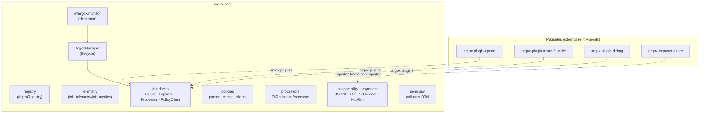

# SDK de Argox

El SDK es la parte de Argox que vive **dentro del proceso del agente**. Su núcleo es el
paquete `argox-core`; las integraciones con frameworks concretos y los exporters
opcionales son paquetes independientes que se descubren por *entry-points*.



## Superficie pública

Lo que un usuario importa (`argox-core/src/argox/__init__.py`):

```python
from argox import (
    monitor,          # decorador de instrumentación
    ArgoxManager,     # orquestador (uso avanzado)
    init_telemetry,   # configura el TracerProvider de OTel
    init_metrics,     # configura el MeterProvider de OTel
    registry,         # registro global de metadatos de agentes (AI Act)
)
```

El uso típico es una sola línea sobre la función que ejecuta el agente:

```python
import argox

@argox.monitor(plugin="openai", policy=my_policy)
def run_agent(prompt: str, agent=None) -> str:
    return Runner.run_sync(agent, prompt)
```

## Mapa de la documentación

| Página | Contenido |
|---|---|
| [core.md](core.md) | `@argox.monitor`, `ArgoxManager`, ciclo de `run()`, `AgentRunMetrics`, `RunContext`, `registry`. |
| [interfaces.md](interfaces.md) | Los cuatro contratos de extensión: `ArgoxPlugin`, `ExporterBase`, `ArgoxProcessor`, `PolicyClient`. |
| [plugins.md](plugins.md) | Discovery por entry-points, plugins oficiales, cómo crear uno. |
| [exporters.md](exporters.md) | `HttpRunExporter` (runs) y span exporters (JSONL, OTLP, Console, Azure Blob). |
| [processors.md](processors.md) | Pipeline de processors y `PiiRedactionProcessor`. |
| [observability.md](observability.md) | OTel: providers, spans, eventos y convenciones semánticas. |
| [packaging.md](packaging.md) | Paquetes, dependencias, extras y entry-points. |

## Paquetes del SDK

| Paquete | Ruta | Rol |
|---|---|---|
| `argox-core` | `argox-project/argox-core` | Núcleo: manager, interfaces, policies, processors, exporters, semconv. |
| `argox-plugin-openai` | `argox-project/argox-plugins/argox-plugin-openai` | Integración con OpenAI Agents SDK. |
| `argox-plugin-azure-foundry` | `argox-project/argox-plugins/argox-plugin-azure-foundry` | Integración con Azure AI Foundry. |
| `argox-plugin-debug` | `argox-project/argox-plugins/argox-plugin-debug` | Plugin mínimo para desarrollo/tests. |
| `argox-exporter-azure` | `argox-project/argox-exporters/argox-exporter-azure` | Span exporter a Azure Blob Storage. |

La explicación conceptual sincronizada con el código vive además en
`argox-project/docs/sdk/overview.md` (living-doc).
