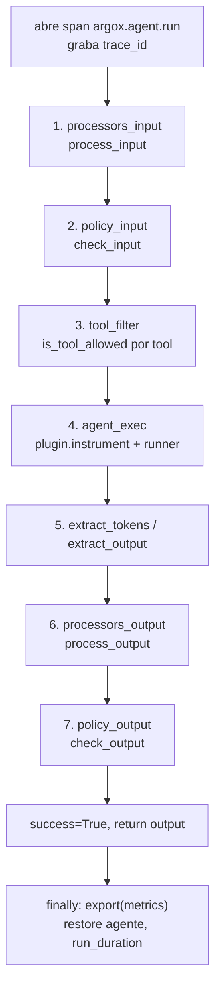

# Core: decorador, manager y ciclo de run

El núcleo del SDK orquesta un run completo del agente. Dos piezas son la entrada: el
decorador `@argox.monitor` (alto nivel) y `ArgoxManager` (el orquestador que el decorador
construye por debajo).

## `@argox.monitor`

`argox-core/src/argox/core/decorator.py`. Envuelve una función de usuario en un
`ArgoxManager`, de modo que una sola decoración sustituye todo el boilerplate de construir
y conducir el manager a mano.

```python
def monitor(
    *,
    plugin: str | ArgoxPlugin,
    agent: Any = None,
    policy: PolicyClient | None = None,
    processors: Iterable[ArgoxProcessor | tuple[ArgoxProcessor, bool]] | None = None,
    exporters: Iterable[ExporterBase] | None = None,
    metadata: dict | None = None,
) -> Callable: ...
```

| Parámetro | Descripción |
|---|---|
| `plugin` | Nombre de entry-point (`"openai"`) resuelto vía `importlib.metadata`, o una instancia `ArgoxPlugin` ya creada. |
| `agent` | Instancia de agente explícita. Si se omite, el decorador la busca en el *closure* y los *globals* de la función. |
| `policy` | `PolicyClient` opcional. Si es `None`, no se ejecuta ninguna comprobación. |
| `processors` | Iterable de processors. Cada item puede ser `ArgoxProcessor` (fail-open) o `(processor, strict)`. |
| `exporters` | Iterable de `ExporterBase` a registrar. |
| `metadata` | Metadatos extra propagados al `RunContext` en cada llamada. |

Comportamiento relevante:

- **Sync y async**: soporta funciones `def` y `async def`. Una función sync envuelta no
  puede llamarse desde un event loop en marcha (lanza `RuntimeError`); en ese caso decora
  un `async def`.
- **Localización del agente**: si no pasas `agent=`, escanea closure y globals buscando un
  objeto con atributos `name` y `tools` (`_looks_like_agent`).
- **Inyección del agente instrumentado**: el manager instrumenta una **copia por-run** del
  agente. Si tu función declara un parámetro `agent`, el decorador inyecta ahí la copia
  instrumentada. Si **no** lo declara, la copia no puede enhebrarse y se emite un
  `RuntimeWarning` ("instrumentation is lost"). **Declara siempre un parámetro `agent`.**
- Dos funciones decoradas con `monitor(...)` comparten el mismo `ArgoxManager`.

## `ArgoxManager`

`argox-core/src/argox/core/manager.py`. Orquesta los ciclos de plugin, exporter,
processor y política.

```python
mgr = ArgoxManager(policy=my_policy, enable_phase_timings=False)
mgr.register_plugin(plugin)
mgr.register_processor(processor, strict=False)
mgr.register_exporter(exporter)
output = await mgr.run(agent, prompt, plugin_name, runner, tools=None, metadata=None)
```

### Registro

| Método | Efecto |
|---|---|
| `register_plugin(plugin)` | Registra un plugin por su `name`. |
| `register_exporter(exporter)` | Añade un exporter a la cadena de export. |
| `register_processor(processor, strict=False)` | Añade un processor. `strict=True` → fail-closed (una excepción aborta el run); `strict=False` → fail-open (la excepción se registra como evento y el pipeline continúa con el valor recibido). |

### `run()` — el ciclo

`run(agent, prompt, plugin_name, runner, tools=None, metadata=None) -> str`. Todo el
ciclo va envuelto en un único span `argox.agent.run`. Pasos:



| Argumento | Descripción |
|---|---|
| `agent` | Objeto de agente del framework, pasado al plugin para instrumentar. |
| `prompt` | Prompt crudo del usuario. |
| `plugin_name` | Clave de un plugin registrado. |
| `runner` | Coroutine `(agente_instrumentado, prompt_procesado) -> raw_result`. |
| `tools` | Nombres de tool a evaluar contra política. Si es `None`, se extraen de `agent.tools`. |
| `metadata` | Pares clave-valor extra para el `RunContext`. |

Lanza `KeyError` si el `plugin_name` no está registrado, y `PolicyError`/`PermissionError`
si una política bloquea (ver [evaluación](../policies/evaluation.md)).

### Detalles de robustez

- **Aislamiento de concurrencia (#153)**: `_prepare_run_agent` instrumenta una copia
  *shallow* del agente, no la instancia compartida, porque el mismo `Agent` suele ser
  conducido por `run()` concurrentes. Si el agente no es copiable, instrumenta la
  instancia y restaura `agent.tools` en el `finally`.
- **`enable_phase_timings`**: off por defecto (coste cero en producción). Cuando se activa,
  cada fase se cronometra en `metrics.phase_timings` (ms) con `perf_counter`; los
  benchmarks lo activan explícitamente.
- **Export tolerante a fallos**: en el `finally`, cada `exporter.export(metrics)` se
  envuelve en try/except; los errores se acumulan en `metrics.exporter_errors` y **nunca**
  abortan el run.

## `AgentRunMetrics`

`argox-core/src/argox/core/state.py`. Acumula todas las métricas y el contexto de un run.
Campos destacados:

| Campo | Tipo | Significado |
|---|---|---|
| `run_id` | `str` (uuid) | Identificador único del run. |
| `trace_id` | `str \| None` | Trace id OTel (hex 32) del span raíz. Une el run con su traza en el Collector. |
| `agent_name` / `agent_version` / `model` | `str` | Identidad del agente y modelo (para coste). |
| `prompt` / `final_output` | `str` | Entrada y salida final. |
| `success` | `bool` | `True` solo si el run terminó sin errores (un block deja `False`). |
| `api_calls` | `list[ApiCallRecord]` | Tokens por llamada al LLM. |
| `tools_available` / `tools_blocked` / `tools_called` | listas | Estado de herramientas. |
| `input_policy_passed` / `output_policy_passed` | `bool` | Resultado de políticas. |
| `policy_violations` | `list[str]` | Razones de block + alert. |
| `phase_timings` | `dict[str,float]` | Tiempos por fase (ms). |

Propiedades: `duration`, `total_input_tokens`, `total_output_tokens`, `total_tokens`.
`to_dict()` serializa todo a un dict JSON-compatible (lo que el `HttpRunExporter` envía a
`/v1/runs`).

## `RunContext`

`argox-core/src/argox/core/context.py`. Objeto ligero que viaja por el run y se pasa a
políticas y processors: lleva `run_id`, `agent_name` y `metadata`.

## `registry` (AgentRegistry)

`argox-core/src/argox/core/registry.py`. Registro global de metadatos de agentes para
trazabilidad (EU AI Act, Art. 12):

```python
from argox import registry

registry.register(
    name="triage-bot", version="1.2.0",
    tools=["search_docs", "create_ticket"],
    description="...", framework="openai", model="gpt-4o-mini",
    system_prompt="...", tags=["support"], config={...},
)
registry.get("triage-bot", "1.2.0")
registry.is_registered("triage-bot", "1.2.0")
```

Siguiente: [los contratos de extensión](interfaces.md).
