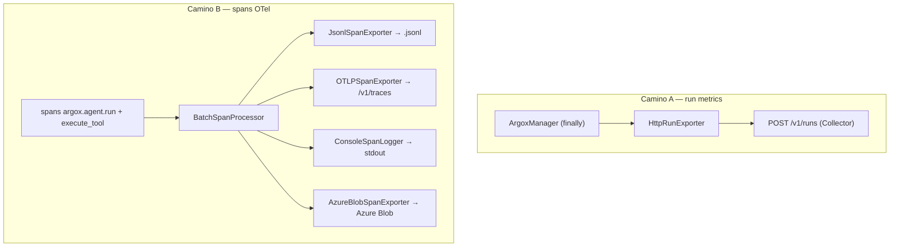

# Exporters

Argox tiene **dos familias** de exporters, que viajan por caminos distintos:

1. **Exporters de run** (`ExporterBase`): reciben el `AgentRunMetrics` completo al final
   del run y lo envían a un destino. El manager los invoca en su `finally`.
2. **Span exporters** (`SpanExporter` de OpenTelemetry): reciben spans vía el
   `BatchSpanProcessor` configurado en `init_telemetry`.



## Exporter de run: `HttpRunExporter`

`argox-core/src/argox/exporters/http_run.py`. Serializa `AgentRunMetrics.to_dict()` y lo
hace `POST` a `/v1/runs` del Collector.

```python
from argox.exporters.http_run import HttpRunExporter

exporter = HttpRunExporter(
    endpoint_url="http://localhost:8000/v1/runs",
    api_key="<key con scope ingest>",   # opcional → Authorization: Bearer
    durable=True,                       # opcional → X-Argox-Durable: true
)

@argox.monitor(plugin="openai", exporters=[exporter])
def run_agent(prompt: str, agent=None) -> str: ...
```

Características:

- **Reintentos con backoff exponencial** ante `5xx`/`429`, respetando el header
  `Retry-After`.
- **Auth Bearer** opcional.
- **Modo durable** (`X-Argox-Durable: true`): pide al Collector confirmar la persistencia
  del blob antes de responder `200` (en lugar del `202` async por defecto).
- **Tolerante a fallos**: errores no reintetables se loguean y **nunca** se re-lanzan, por
  el contrato de `ExporterBase` (no interrumpir el agente). Los fallos quedan en
  `metrics.exporter_errors`.

## Span exporters (OpenTelemetry)

Se conectan al `TracerProvider` vía `init_telemetry(exporters=[...])`, que envuelve cada
uno en un `BatchSpanProcessor`. Ver [observabilidad](observability.md).

| Exporter | Archivo | Destino |
|---|---|---|
| `JsonlSpanExporter` | `observability/jsonl.py` | Archivo `.jsonl` local (una línea por span). Desarrollo/debug. |
| `OTLPSpanExporter` | `observability/otlp.py` | Collector OTel vía HTTP/protobuf (default `http://localhost:4318/v1/traces`). Es la ruta a `/v1/traces` del Argox Collector. |
| `ConsoleSpanLogger` | `observability/span_loggers.py` | `stdout`, resúmenes de una línea legibles. |
| `AzureBlobSpanExporter` | `argox-exporter-azure` (paquete aparte) | Azure Blob Storage, ruta `spans/{YYYY}/{MM}/{DD}/{HH}/{batch_id}.jsonl`. |

```python
from argox import init_telemetry
from argox.observability import JsonlSpanExporter, OTLPSpanExporter

init_telemetry(
    service_name="triage-bot",
    exporters=[
        OTLPSpanExporter(endpoint="http://localhost:4318/v1/traces"),
        JsonlSpanExporter(path="./spans.jsonl"),
    ],
)
```

El `AzureBlobSpanExporter` vive en el paquete opcional `argox-exporter-azure`:

```python
from argox_azure.exporter import AzureBlobSpanExporter

exporter = AzureBlobSpanExporter(
    connection_string="<azure-conn-string>",
    container_name="argox",
    prefix="spans",
)
init_telemetry(exporters=[exporter])
```

## Qué exporter usar

| Objetivo | Exporter |
|---|---|
| Enviar runs al dashboard/Collector | `HttpRunExporter` → `/v1/runs` |
| Enviar trazas al Collector | `OTLPSpanExporter` → `/v1/traces` |
| Depurar localmente | `JsonlSpanExporter` + `ConsoleSpanLogger` |
| Archivar spans crudos en cloud | `AzureBlobSpanExporter` |

Un exporter custom solo necesita implementar `ExporterBase.export` (para runs) o
`SpanExporter` de OTel (para spans). Ver el contrato en [interfaces](interfaces.md).

Siguiente: [los processors](processors.md).
