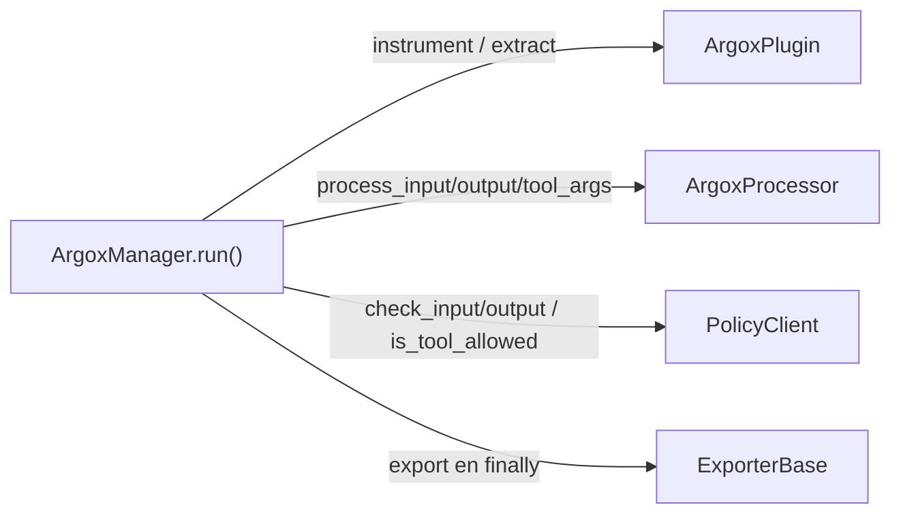

# Interfaces de extensión

El SDK se extiende implementando uno de cuatro contratos abstractos, todos en
`argox-core/src/argox/interfaces/`. El `ArgoxManager` solo conoce estas interfaces, nunca
las implementaciones concretas: así el núcleo es agnóstico del framework, del destino de
export, de la transformación y del transporte de políticas.

| Interfaz | Archivo | Responsabilidad |
|---|---|---|
| `ArgoxPlugin` | `interfaces/plugin.py` | Hablar con un framework de agentes concreto. |
| `ExporterBase` | `interfaces/exporter.py` | Enviar `AgentRunMetrics` a un destino. |
| `ArgoxProcessor` | `interfaces/processor.py` | Transformar datos in-flight. |
| `PolicyClient` | `interfaces/policy.py` | Evaluar políticas (transporte abstracto). |

## `ArgoxPlugin`

Un plugin hace tres cosas y **nada más** (no instancia métricas ni aplica políticas — eso
es del manager):

```python
class ArgoxPlugin(ABC):
    @property
    @abstractmethod
    def name(self) -> str: ...                       # id único, minúsculas

    @abstractmethod
    def instrument(self, target, metrics, tool_args_runner=None) -> Any: ...

    @abstractmethod
    def extract_tokens(self, raw_result, metrics) -> None: ...

    @abstractmethod
    def extract_output(self, raw_result) -> str: ...
```

- **`name`** — identificador único en minúsculas (`"openai"`); clave de registro.
- **`instrument(target, metrics, tool_args_runner)`** — se llama **antes** de ejecutar.
  Configura hooks/callbacks del framework para que los eventos se graben en `metrics`. Si
  `tool_args_runner` no es `None`, el plugin debe interceptar cada llamada a tool y
  `await tool_args_runner(tool_name, args)` antes de delegar en la tool nativa (así corren
  los processors de `tool_args`). Devuelve el `target` instrumentado.
- **`extract_tokens(raw_result, metrics)`** — se llama **después**. Lee el resultado del
  framework y añade `ApiCallRecord` a `metrics.api_calls`. No devuelve nada.
- **`extract_output(raw_result)`** — normaliza la salida del framework a `str`.

`ToolArgsRunner` es el tipo del callable que el manager construye por run:
`Callable[[str, dict], Awaitable[dict]]`. Detalle en [plugins](plugins.md).

## `ExporterBase`

Recibe un `AgentRunMetrics` ya poblado (el run terminó) y lo envía a un destino:

```python
class ExporterBase(ABC):
    @abstractmethod
    def export(self, metrics: AgentRunMetrics) -> None: ...
```

- Se invoca **una vez por run**, en el `finally` del manager, tras aplicar políticas de
  output.
- El `metrics` es de **solo lectura**: el exporter no debe modificarlo, salvo añadir
  mensajes de diagnóstico a `metrics.exporter_errors`.
- Debe ser **tolerante a fallos**: si el destino no está disponible, se recomienda loguear
  y **no** re-lanzar, para no interrumpir el flujo del agente.

Implementaciones oficiales: `HttpRunExporter`, y (de span) JSONL/OTLP/Console/Azure Blob.
Ver [exporters](exporters.md).

## `ArgoxProcessor`

Transforma datos **reales** del agente in-flight (no telemetría, a diferencia del
`SpanProcessor` de OTel). Tres fases:

```python
class ArgoxProcessor(ABC):
    @abstractmethod
    async def process_input(self, text: str, ctx: RunContext) -> str: ...

    @abstractmethod
    async def process_tool_args(self, tool_name: str, args: dict, ctx: RunContext) -> dict: ...

    @abstractmethod
    async def process_output(self, text: str, ctx: RunContext) -> str: ...
```

- **`process_input`** — transforma el prompt antes de llegar al LLM.
- **`process_tool_args`** — transforma/valida los argumentos de una tool antes de
  ejecutarla. El manager pasa una **copia profunda** de `args`, así que un processor
  fail-open que mute en sitio y luego falle no filtra cambios parciales.
- **`process_output`** — transforma/audita la respuesta antes de devolverla.

Los processors corren en orden de registro. Su semántica de fallo (strict vs fail-open) la
fija `register_processor(processor, strict=...)`. Ver [processors](processors.md).

## `PolicyClient`

Abstrae el transporte de políticas. El manager solo conoce esta interfaz; las
implementaciones concretas (`LocalPolicyClient`, `RemotePolicyClient`) son intercambiables.

```python
class PolicyClient(ABC):
    @abstractmethod
    async def check_input(self, text: str) -> PolicyResult: ...

    @abstractmethod
    async def is_tool_allowed(self, tool_name: str) -> PolicyResult: ...

    @abstractmethod
    async def check_output(self, text: str) -> PolicyResult: ...
```

Reglas que toda implementación debe cumplir:

- **No lanzar excepciones al manager**: capturar internamente y devolver
  `PolicyResult.block(...)` si algo falla.
- **Fail-safe ante errores de red**: aplicar la política de fallback configurada (por
  defecto: permitir con warning en el cliente remoto).
- **Stateless por llamada**: el estado de la caché es interno a la implementación.

`PolicyResult` es el resultado inmutable con `passed`, `reason`, `rule_id` y los
constructores `ok()`, `block()`, `alert()`. Detalle completo del sistema de políticas en
[el capítulo de políticas](../policies/README.md).

## Cómo encajan en el run



Siguiente: [el sistema de plugins en detalle](plugins.md).
