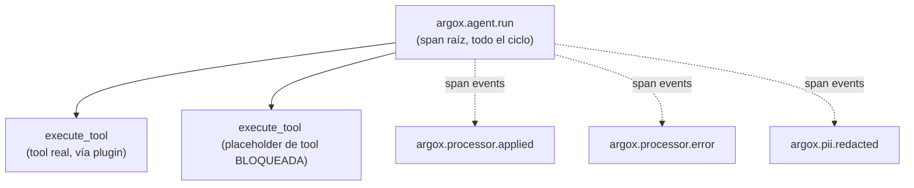

# Observabilidad OTel y convenciones semánticas

Argox se construye sobre **OpenTelemetry**. El SDK emite spans y métricas que siguen las
*GenAI Semantic Conventions* estándar, extendidas con atributos `argox.*` para gobernanza
y auditoría.

## Inicialización de OTel

`argox-core/src/argox/core/telemetry.py`.

### `init_telemetry`

Configura el `TracerProvider` con un `Resource` y un `BatchSpanProcessor` por cada
exporter. Lo registra globalmente.

```python
from argox import init_telemetry
from argox.observability import OTLPSpanExporter

provider = init_telemetry(
    service_name="triage-bot",
    service_version="1.2.0",
    exporters=[OTLPSpanExporter(endpoint="http://localhost:4318/v1/traces")],
)
```

El `Resource` lleva `service.name`, `service.version` y `telemetry.distro.name = "argox"`.

### `init_metrics`

Configura el `MeterProvider`. Dos formas de conectar sinks (combinables):

- **`exporters`**: cada uno se auto-envuelve en un `PeriodicExportingMetricReader` con
  `export_interval_ms` (default 60000). Caso push común (Console, OTLP).
- **`readers`**: se adjuntan tal cual. Para readers crudos como `InMemoryMetricReader`
  (tests) o un reader pull-based de Prometheus.

```python
from argox import init_metrics
provider = init_metrics(service_name="triage-bot", exporters=[...], views=[...])
```

## Spans emitidos



- **`argox.agent.run`** — span raíz que cubre todo el ciclo. Lleva el `agent_name`, los
  tokens (`gen_ai.usage.*`), la decisión de política y, en su `trace_id`, la clave que une
  el run con su traza en el Collector.
- **`execute_tool <tool>`** — un span por ejecución de tool (lo abre el plugin). Para una
  tool **bloqueada** por política, el manager emite un span placeholder de duración cero
  con `argox.policy.decision=block`, para que el bloqueo sea visible en el waterfall y en
  las métricas (el Collector solo indexa decisiones desde spans).

## Convenciones semánticas (`semconv/attributes.py`)

### Atributos GenAI estándar usados

| Atributo | Significado |
|---|---|
| `gen_ai.usage.input_tokens` / `gen_ai.usage.output_tokens` | Tokens de entrada/salida del run. |
| `gen_ai.request.model` | Modelo usado (clave para el backfill de coste en el Collector). |
| `gen_ai.operation.name` / `gen_ai.tool.name` | Operación (`execute_tool`) y nombre de tool. |

### Atributos `argox.*`

| Atributo | Valores | Uso |
|---|---|---|
| `argox.agent.name` | string | Nombre lógico del agente. |
| `argox.agent.version` | string | Versión registrada del agente. |
| `argox.policy.decision` | `ok` / `block` / `alert` | Resultado de la evaluación de política. |
| `argox.policy.rule_id` | string | Regla que disparó block/alert. |
| `argox.processor.applied` | lista | Processors que transformaron el dato. |
| `argox.processor.name` / `.phase` / `.tool_name` / `.strict` / `.status` | varios | Detalle por evento de processor. |
| `argox.pii.redactions` | lista `"<ENTITY>:<count>"` | Conteos de redacción de PII (sin valores crudos). |
| `argox.run.blocked_tools` | lista | Tools filtradas por política en el run. |
| `argox.run.success` | bool | Run completado sin errores no controlados. |
| `argox.run.cost` | float | Coste estimado del run en USD. |

### Span events

| Evento | Cuándo |
|---|---|
| `argox.processor.applied` | Invocación de processor con éxito. |
| `argox.processor.error` | Un processor lanzó. |
| `argox.pii.redacted` | El processor de PII realizó redacciones. |

### Instrumentos de métrica

| Métrica | Tipo | Qué cuenta |
|---|---|---|
| `gen_ai.client.token.usage` | Counter | Tokens de entrada/salida (atributo `gen_ai.token.type`). |
| `gen_ai.client.operation.duration` | Histogram | Duración total del run (s). |
| `argox.policy.decisions` | Counter | Decisiones de política emitidas. |
| `argox.processor.invocations` | Counter | Invocaciones de processor por fase y resultado. |

Estos atributos son el contrato que el Collector aplana y promociona a columnas
consultables; ver [almacenamiento e índice](../collector/storage-and-index.md).

Siguiente: [empaquetado](packaging.md).
