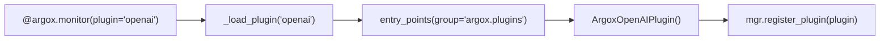
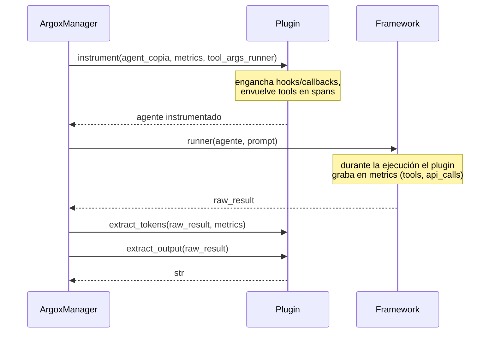

# Plugins

Un plugin conecta el SDK con un framework de agentes concreto. El núcleo `argox-core` no
depende de ningún framework: cada integración es un paquete instalable
`argox-plugin-<framework>` que implementa `ArgoxPlugin` y se publica bajo el grupo de
*entry-points* `argox.plugins`.

## Discovery por entry-points

`@argox.monitor(plugin="openai")` resuelve el plugin por nombre vía
`importlib.metadata` (`decorator.py::_load_plugin`):

```python
from importlib.metadata import entry_points
eps = entry_points(group="argox.plugins")
for ep in eps:
    if ep.name == name:
        return ep.load()()        # instancia la clase del plugin
raise LookupError(f"No Argox plugin registered for '{name}'. ...")
```

Cada paquete de plugin declara su entry-point en `pyproject.toml`:

```toml
# argox-plugin-openai/pyproject.toml
[project.entry_points."argox.plugins"]
openai = "argox_openai:ArgoxOpenAIPlugin"
```



También puedes pasar una **instancia** de plugin en lugar del nombre:
`@argox.monitor(plugin=MyPlugin())`.

## Plugins oficiales

| Nombre | Paquete | Entry-point | Integra |
|---|---|---|---|
| `openai` | `argox-plugin-openai` | `openai = "argox_openai:ArgoxOpenAIPlugin"` | OpenAI Agents SDK (`openai-agents`). |
| `azure-foundry` | `argox-plugin-azure-foundry` | `azure-foundry = "argox_azure_foundry:ArgoxAzureFoundryPlugin"` | Azure AI Foundry. |
| `debug` | `argox-plugin-debug` | `debug = "argox_debug:ArgoxDebugPlugin"` | Plugin mínimo para desarrollo/tests. |

El plugin de OpenAI engancha los lifecycle hooks del Agents SDK, envuelve las tools en
spans OTel `execute_tool`, extrae el uso de tokens del `RunResult` y estampa el modelo
(`gen_ai.request.model`) que el Collector usa para backfill de coste.

## Anatomía de un plugin

Los tres métodos del contrato (`interfaces/plugin.py`) y cuándo se invocan en el run:



## Crear un plugin propio

1. **Implementa `ArgoxPlugin`:**

```python
from argox.interfaces.plugin import ArgoxPlugin, ToolArgsRunner
from argox.core.state import AgentRunMetrics, ApiCallRecord

class MyFrameworkPlugin(ArgoxPlugin):
    @property
    def name(self) -> str:
        return "my_framework"

    def instrument(self, target, metrics, tool_args_runner: ToolArgsRunner | None = None):
        # Engancha hooks del framework para grabar en `metrics`.
        # Si tool_args_runner no es None, intercepta cada tool y haz
        # args = await tool_args_runner(tool_name, args) antes de ejecutarla.
        return target

    def extract_tokens(self, raw_result, metrics):
        for call in raw_result.usage_records:
            metrics.api_calls.append(ApiCallRecord(
                call_number=len(metrics.api_calls) + 1,
                input_tokens=call.input, output_tokens=call.output,
                total_tokens=call.total,
            ))

    def extract_output(self, raw_result) -> str:
        return raw_result.text
```

2. **Publica el entry-point** en tu `pyproject.toml`:

```toml
[project.entry_points."argox.plugins"]
my_framework = "my_pkg:MyFrameworkPlugin"
```

3. **Instala y úsalo:** `pip install -e .` y luego
   `@argox.monitor(plugin="my_framework")`.

### Buenas prácticas

- **No mutes la instancia compartida del agente**: el manager te pasa una copia por-run.
  Reescribe solo `tools`/`hooks` de esa copia.
- **Respeta el `tool_args_runner`**: es el único camino para que los processors de
  `tool_args` se apliquen. No mires la lista de processors directamente.
- **Sé defensivo en la extracción**: si el framework no expone tokens o modelo, deja los
  campos vacíos en vez de lanzar.

Siguiente: [los exporters](exporters.md).
