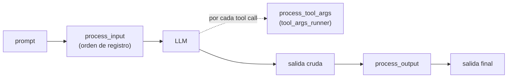

# Processors y redacción de PII

Un **processor** transforma datos **reales** del agente in-flight: el prompt antes de
llegar al LLM, los argumentos de una tool antes de ejecutarla, y la salida antes de
devolverla. A diferencia del `SpanProcessor` de OpenTelemetry (que transforma telemetría),
un `ArgoxProcessor` transforma los datos del propio agente. Caso de uso principal:
**redacción de PII** y sanitización de secretos en el borde, antes de que el dato salga del
proceso.

## El pipeline de processors

Los processors se registran en orden y corren en las tres fases. La semántica de fallo se
fija por processor en `register_processor(processor, strict=...)` (o pasando
`(processor, strict)` en `@argox.monitor(processors=[...])`).



| Modo | `strict` | Comportamiento ante excepción |
|---|---|---|
| **Fail-open** (default) | `False` | Se emite un span event `argox.processor.error` y el valor recibido se pasa **sin cambios** al siguiente processor. El run continúa. |
| **Fail-closed** | `True` | La excepción se propaga, el span se marca ERROR y el run aborta. |

`asyncio.CancelledError` siempre se propaga (es control de flujo, no un fallo del
processor), independientemente del modo.

Cada invocación con éxito emite un span event `argox.processor.applied` (con
`argox.processor.name` y `argox.processor.phase`) y registra el nombre de la clase en
`argox.processor.applied` (atributo de run). En `process_tool_args`, el manager pasa una
**copia profunda** de los args para que un processor fail-open que mute en sitio y luego
falle no filtre cambios parciales.

## `PiiRedactionProcessor`

`argox-core/src/argox/processors/pii.py`. Processor incorporado, **regex puro y sin
dependencias**, que limpia PII común en las tres fases (`process_input` opt-in,
`process_tool_args` con traversal recursivo, `process_output`).

### Modos de redacción

```python
class RedactionMode(str, enum.Enum):
    MASK = "mask"   # reemplaza por [REDACTED:<ENTITY>]
    HASH = "hash"   # primeros 12 hex de sha256(value + salt) — joins deterministas
    DROP = "drop"   # reemplaza por cadena vacía
```

| Modo | Resultado | Cuándo usarlo |
|---|---|---|
| `MASK` | `[REDACTED:EMAIL]` | Legibilidad: se ve que había un email. |
| `HASH` | `a1b2c3d4e5f6` | Correlación: el mismo valor colisiona de forma determinista aguas abajo. |
| `DROP` | `` (vacío) | Eliminación total del valor. |

### Eventos de span

Cuando redacta, emite el span event `argox.pii.redacted` (distinto de
`argox.processor.applied`, que el manager emite por cada invocación con efecto o sin él),
con `argox.pii.redactions` = lista de `"<ENTITY>:<count>"`. **Nunca** se registran los
valores crudos: solo conteos por entidad, codificados como strings para atravesar
cualquier exporter OTel (los atributos no admiten dicts anidados).

### Detector pluggable

El detector es pluggable vía un `Protocol` (`Detector`), de modo que un backend más rico
(p.ej. `presidio-analyzer`) puede conectarse después sin cambiar la superficie pública del
processor. Cada detección es un `EntityMatch(start, end, entity, value)`: offsets de
carácter, etiqueta de entidad (p.ej. `"EMAIL"`) y el valor crudo (que `HASH` necesita y
que nunca se loguea).

## Uso

```python
import argox
from argox.processors.pii import PiiRedactionProcessor, RedactionMode

pii = PiiRedactionProcessor(mode=RedactionMode.MASK)

@argox.monitor(
    plugin="openai",
    processors=[pii],                 # fail-open por defecto
    # processors=[(pii, True)],       # fail-closed: aborta el run si falla
)
def run_agent(prompt: str, agent=None) -> str: ...
```

Combinar con políticas es habitual: el processor **redacta** (transforma) y la política
**decide** (bloquea/alerta). Por ejemplo, redactar emails en la salida y, además, bloquear
si la salida contiene un patrón de secreto. Ver
[políticas](../policies/README.md).

Siguiente: [observabilidad OTel](observability.md).
